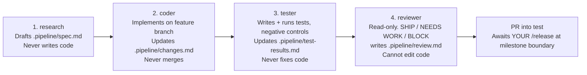

# 🛠️ Project Execution Strategy & Operating Blueprint: Engine-Powered Quality Engineering Skills

> **Document Version:** 2.0 — rescoped after peer review (see `Peer_Review_On_Execution_And_Roadmap.md`)
> **Target Product Release:** `v1.0.0` (8-domain scope — see `ROADMAP.md`)
> **Pacing:** Milestone- and issue-driven. No calendar days appear in this document — see "How this executes" below.
> **Companion Document:** `ROADMAP.md` & `Idea.md`

---

## 🎯 Executive Strategy & Product Vision

This project solves a fundamental defect in existing AI quality tools: LLMs operating in prompt memory hallucinate engineering math. The strategy decouples qualitative AI reasoning (guided by `agentskills.io` markdown prompts) from quantitative statistical execution (handled by 100%-branch-covered Python calculation engines in `packages/quality-core`), communicating over the **Model Context Protocol (MCP)** and viewable through a minimal, incrementally-hardened Localhost Canvas.

```
  ┌────────────────────────────────────────────────────────────────────────┐
  │                        THE PRODUCT TRIAD                              │
  ├───────────────────────┬────────────────────────┬───────────────────────┤
  │   1. AI Agent Skills  │  2. Deterministic Core │  3. Localhost Canvas  │
  │ • Markdown Methodology│ • Python Math Engines  │ • Live Web Visual UI  │
  │ • Claude/Cursor/AGY   │ • 100% Branch Coverage │ • Single-Writer v1.0  │
  │ • ISO/IATF/VDA Rules  │ • Cited AIAG/VDA Const.│ • Full Sync = v2      │
  └───────────────────────┴────────────────────────┴───────────────────────┘
```

---

## How this executes: milestones, not dates

Every version in `ROADMAP.md` is a **GitHub Milestone**. Every milestone contains a fixed set of **Epics** (one per engine/domain in that version). Every Epic is a set of **Issues** in the format below. A milestone is done — and the version ships — when every issue in it is closed and its CI gates are green. There is no day budget attached to any of this on purpose: pacing is a function of how many agents get spun up against a milestone's open issues at once, which is decided per-milestone, not scheduled in advance. The calendar-side planning (how many milestones per week, overall target date) lives with you, not in this document.

---

## 📋 Project Management Framework & GitHub Workflow

### 1. Milestone & Issue Structure
* **Milestones**: One per version (`v0.1.0` … `v1.0.0`), per `ROADMAP.md`.
* **Epics**: One per domain within a milestone (e.g. `[EPIC] FMEA via MCP`, `[EPIC] RCA Suite`, `[EPIC] PPAP Core`).
* **Task Issues**: Standardized format:
  ```markdown
  ### User Story
  As a Quality Engineer, I want to [action] so that [business outcome].

  ### Technical Scope & Engine Location
  - Skill: `skills/[domain]/[skill-name]/SKILL.md`
  - Engine: `packages/quality-core/src/quality_core/[module]/`
  - MCP Tool: `packages/quality-mcp/src/quality_mcp/tools/[tool_name].py`
  - CI Gate: new `--cov=quality_core.[module] --cov-fail-under=100` (or `quality_mcp.tools.[module]`) job added to `.github/workflows/ci.yml`, commented in the same style as the existing 8 gates — explain *why* this surface needs its own gate, not just that it does.

  ### Acceptance Criteria
  - [ ] Python engine math verified with 100% branch test coverage, including negative controls.
  - [ ] Any new standard-body constant/threshold cited in `apps/<domain>/docs/ASSUMPTIONS_LOG.md`, verified against the licensed manual — never against a web search.
  - [ ] MCP tool binding registered and verified against an actual MCP client round-trip (Claude Code / Cursor), not just a unit test.
  - [ ] Canvas component rendered (from `v0.2.0` onward) and round-trips at least one edit.
  ```

### 2. Branching & PR Discipline — corrected to match the repo's actual ladder
This repo runs a **3-stage branch ladder**: `feature → test → main`. (`dev` was intentionally dropped — it was a pass-through that only added merge conflicts; reintroduce it only if parallel release trains ever appear. See `CLAUDE.md`.)
* Every feature branch is based on **`origin/test`**, never `origin/main`.
* `/ship` opens a PR into `test` only. It never merges anything.
* **Nobody but you merges into `test` or `main`.** Getting a version from a green `test` milestone to a tagged `main` release is one step you personally run: `/release` (`test → main`, tags the version), after you review the code. Budget your own review/release time as part of when a milestone's version actually ships — the agents finishing their issues is necessary but not sufficient.
* Feature branch naming: `feat/[domain]-[feature-name]` (e.g. `feat/rca-5why-validator`, `feat/ppap-core-18-element`).

### 3. PR Requirements
* 100% passing unit/integration tests (`pytest`), including the new coverage gate for this issue's surface.
* 0 lint or type errors (`uv run ruff check .` and `uv run mypy`).
* Skill markdown adheres to the `agentskills.io` standard.
* `ASSUMPTIONS_LOG.md` updated for any new cited constant.

---

## 🤖 Ship Pipeline & Subagent Delegation — corrected to 4 stages

The actual pipeline this repo runs (`.claude/agents/`) is **4 stages**, not 3. The 4th stage — `reviewer` — is read-only by tool restriction, and `CLAUDE.md` is explicit that this restriction *is* the review gate: without it, the gate is theatre. Any description of this pipeline that drops the reviewer stage is describing a weaker process than the one actually enforced.



1. **`research`** — investigates domain requirements, the relevant AIAG/IATF/VDA clauses (against the licensed manual, not web search), and prior art in this codebase. Writes `.pipeline/spec.md`. Never writes code.
2. **`coder`** — implements exactly the spec: Python engine, MCP tool binding, skill markdown, canvas component if in scope for that version. Writes `.pipeline/changes.md`. Never commits directly to `test`/`main`.
3. **`tester`** — writes and runs unit, integration, and negative-control tests; checks the new coverage gate; verifies any cited constant against `ASSUMPTIONS_LOG.md`. Writes `.pipeline/test-results.md`. Never edits source.
4. **`reviewer`** — reads the spec, changes, test results, and diff; writes a SHIP / NEEDS WORK / BLOCK verdict to `.pipeline/review.md`. Cannot edit anything.

Per `CLAUDE.md`: one agent, one worktree — never run two agents in the same checkout, since branch state is per-checkout and a second agent's `git switch`/`git reset` can silently wipe a first agent's uncommitted work. If you spin up multiple agents in parallel against a milestone's open issues, give each its own `git worktree add` and say so explicitly in the handoff.

---

## 🏗️ Milestone Build Order

Full per-version deliverables and gate criteria live in `ROADMAP.md`. In execution terms, each milestone below is "spin up agents against this epic's issues until the milestone's issues are all closed and green," in this order:

1. **`v0.1.0` — Platform Setup**: stand up `packages/quality-mcp` as a new `uv` workspace member with `FastMCP` as a dependency; extend the CI "core dependency contract" job so it also guards `quality-mcp`'s resolved dependency tree; stand up the GitHub milestone/epic/issue structure itself. **Do not remove or touch the existing Streamlit apps (`app.py`, `shell/`, `apps/*/pages`)** — they're tested, working products; the MCP/skill path is additive, not a replacement, unless you decide otherwise later.
2. **`v0.2.0`–`v0.5.0` — Wrap the 4 existing engines** (FMEA, SPC, MSA, Control Plan): one MCP tool + one skill + one CI gate + one canvas component per engine, reusing `apps/*` math and tests that already exist and are already 100%-covered. `v0.2.0` is where the canvas pattern (minimal, single-writer, no locking) gets built once and reused by the other three.
3. **`v0.6.0`–`v0.9.0` — One new domain per version**, per the category-diversified picks in `ROADMAP.md` (RCA Suite, NCR/COPQ, PPAP Core, Supplier SCAR). Each of these is a new `quality_core` module built from scratch against a licensed standard, with its own `ASSUMPTIONS_LOG.md` entries and its own CI gate — treat the ceremony from `v0.6.0` as the template for `v0.7.0`–`v0.9.0`, not something to reinvent per version.
4. **`v1.0.0` — Hardening**: Excel exporters with live formulas (not hardcoded values) across all 8 domains; a full `ASSUMPTIONS_LOG.md` audit; an end-to-end regression pass. Desktop packaging, sha256 audit-hash logs, and local-LLM support are v2 backlog — don't let them block this release.

---

## 🛡️ Risk Management & Mitigation Matrix

| Risk Event | Severity | Impact Area | Mitigation Strategy |
| :--- | :--- | :--- | :--- |
| **Compressing scope instead of cutting it** | Critical | Whole roadmap | This is what the `v1.0.0` rescoping in `ROADMAP.md` exists to prevent — 8 domains with real coverage beats 18 domains with corners cut. Don't add scope back into `v1.0.0` without moving something else out. |
| **Release bottleneck** (`test→main` needs you) | High | Release cadence | Track "issues closed, PR green in `test`" separately from "tagged on `main`" — a milestone can be code-complete before it's released; don't let that gap look like agent slowness. |
| **New CI gates silently skipped** | High | Coverage integrity | Every new-domain issue's acceptance criteria explicitly includes adding its own commented CI gate, modeled on the 8 that already exist — this is now a checklist item, not an afterthought. |
| **Concurrent UI vs AI edit collisions** | Medium (was High) | Canvas | Deferred by scoping `v0.2.0`–`v1.0.0`'s canvas to single-writer only; full concurrent-edit conflict resolution (cell locks, JSON-Patch, stable row IDs) is v2 backlog, to be designed deliberately rather than shipped as a side-task. |
| **Standards-citation shortcuts under agent throughput pressure** | Critical | Compliance/trust | Every acceptance criteria list requires an `ASSUMPTIONS_LOG.md` citation verified against the licensed manual before a PR is reviewer-eligible — no exceptions for "we have plenty of agent tokens." |
| **LLM Math Hallucination** | Critical | Accuracy | Unchanged from original: LLMs never perform calculations; all math routes through `quality-core` via MCP. |

---

## 🏁 Definition of Done for `v1.0.0`

See `ROADMAP.md`'s Definition of Done — 8 domains (4 wrapped + 4 new), each with its own CI gate, MCP tool, skill, canvas component, and cited standards documentation. Full 18-skill coverage, desktop packaging, and compliance audit-hash logging are `v2` goals, not `v1.0.0` blockers.

*Execution strategy rescoped and authorized for implementation.*
