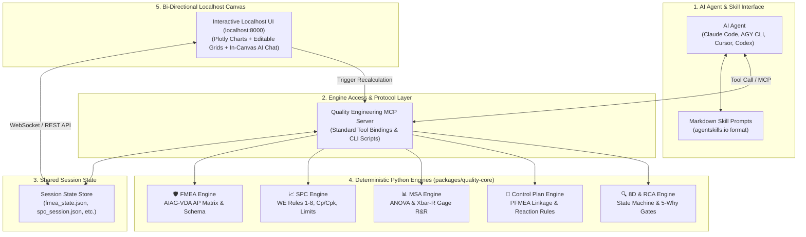
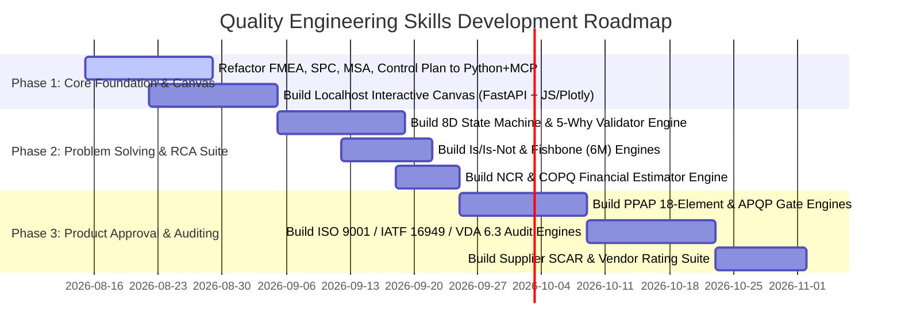

# 🚀 Project Vision & Architecture Spec: Engine-Powered Quality Engineering Skills

> **Document Version:** 2.0 (Cleaned & Peer-Reviewed)  
> **Status:** Approved Architecture Spec  
> **Target Repository:** [Siddardth7/quality-engineering-skills](https://github.com/Siddardth7/quality-engineering-skills)  
> **Inspiration & Baselines:** [RBraga01/Quality-Engineering-Skills](https://github.com/RBraga01/Quality-Engineering-Skills) & [Siddardth7/quality-platform](https://github.com/Siddardth7/quality-platform)

---

## 🎯 Executive Summary

The **Engine-Powered Quality Engineering Skills** platform is an intelligent, developer-friendly ecosystem designed to assist manufacturing, quality, and reliability engineers in their daily workflows.

By combining **AI Agent Skills** (compatible with Claude Code, Cursor, AGY CLI, and Codex) with **deterministic, 100% test-covered Python calculation engines** (`packages/quality-core`) and an **interactive bi-directional Localhost Canvas**, this project bridges the gap between AI-driven reasoning and mathematically exact quality standards (AIAG-VDA 2019, IATF 16949, ISO 9001, VDA 6.3).

```
   ┌────────────────────────────────────────────────────────────────────────┐
   │             ENGINE-POWERED QUALITY ENGINEERING SKILLS                 │
   ├───────────────────────────────┬────────────────────────────────────────┤
   │    AI Reasoning & Standards   │   Deterministic Computation Engines    │
   │  • AIAG-VDA 2019 FMEA Guidance│  • 100% Exact Math (Cp, Cpk, Gage R&R)  │
   │  • 8D & 5-Why Root Cause Rules│  • Western Electric Rules 1-8 Engine   │
   │  • ISO 9001 / IATF Audit Bank │  • AIAG-VDA AP Matrix Lookup Engine   │
   ├───────────────────────────────┴────────────────────────────────────────┤
   │                    BI-DIRECTIONAL LOCALHOST CANVAS                     │
   │      Live visual interactive synchronization (Chat ↔ Canvas ↔ Math)    │
   └────────────────────────────────────────────────────────────────────────┘
```

---

## 💡 Industry Gap Analysis & Problem Statement

### 1. The Limit of Prompt-Only AI Skills (The RBraga01 Gap)
* **Current State**: Open-source repositories like `RBraga01/Quality-Engineering-Skills` package ISO/IATF guidelines into markdown skills, agent prompts, helper scripts, and platform adapters.
* **The Problem**: LLMs operating in prompt memory lack floating-point execution units and hallucinate statistical calculations. They miscalculate $C_p / C_{pk}$, draw invalid control chart limits, miscalculate ANOVA/Xbar-R Gauge R&R variance percentages, and make arithmetic errors on Action Priority (AP) matrix lookups.
* **Our Solution**: Every AI skill is backed by verified, unit-tested Python computation engines in `packages/quality-core`. The AI handles qualitative reasoning; the Python engine handles exact math.

### 2. The Limit of Monolithic Quality Apps (The Legacy Software Gap)
* **Current State**: Traditional software (Minitab, ETQ Reliance, APIS IQ-Software, Relyence, Sphera, Plex) locks data inside proprietary databases, binary file formats (`.mpx`), or locked SaaS UIs.
* **The Problem**: Quality engineers working with local CSVs, Excel workbooks, or Markdown reports cannot easily automate, script, or integrate AI into their workflow.
* **Our Solution**: A local-first, engine-backed skill architecture. No cloud vendor lock-in. Works directly on plain text, CSV, Excel, and JSON files in the engineer's workspace.

### 3. The Need for Visual Interactivity Without Web App Bloat
* **Current State**: Quality engineers need to *see* control charts, histograms, interaction plots, and Pareto diagrams, not just read text outputs.
* **The Solution**: An **on-demand Bi-directional Localhost Canvas** (`localhost:8000`). It renders interactive Plotly/Chart.js graphics and editable data grids that stay in 2-way real-time sync with both the engineer and the AI agent.

---

## 🏗️ Architectural Blueprint

The platform consists of five decoupled, highly specialized layers:



### Layer Details:
1. **Skill Prompt Layer**: Pure markdown definitions outlining methodology rules (e.g. D0-D8 steps, 6M Ishikawa categories, ISO audit questions).
2. **MCP / Tool Binding Layer**: Standardized Model Context Protocol (MCP) server exposing `quality-core` functions natively to AI agents as executable tools.
3. **Shared Session State**: Single-source-of-truth JSON file per analysis session.
4. **Deterministic Python Engines**: High-performance, 100% unit-tested code executing mathematical algorithms and schema validations.
5. **Bi-directional Localhost Canvas**: A lightweight FastAPI server hosting an interactive HTML5/JavaScript workspace. Uses **JSON-Patch (RFC 6902)** over WebSockets with **field-level focus locks** (<30ms sync). When data is edited in the visual canvas (e.g., changing an FMEA severity rating or an SPC spec limit), the state updates, the Python engine recalculates math, and the AI agent updates its memory in real time.

---

## 🔄 Bi-Directional Traffic Flow

```
   [ AI Agent Chat ]  ──(1. Run Skill / Generate Analysis)──►  [ Shared State JSON ]
           ▲                                                           │
           │                                                           ▼
   (4. AI Explains Shift)                                   (2. Live Server Render)
           │                                                           │
           │                                                           ▼
   [ Python Engine ]  ◄──(3. Tweak Limit / Edit Data Cell)───  [ Localhost Canvas ]
```

1. **AI Chat $\rightarrow$ Localhost Canvas**: The engineer asks the AI to analyze a dataset. The AI executes the skill, updates the session JSON, and the Localhost browser instantly renders interactive control charts, histograms, and capability gauges.
2. **Localhost Canvas $\rightarrow$ AI & Python Engine**: The engineer adjusts spec limits or edits data rows directly on the browser canvas. The change triggers `quality-core` to recalculate metrics ($C_{pk}$, AP risk tiers, Gage R&R %GRR) and pushes updated context back to the AI chat.

---

## 🏬 Shop-Floor Metrology Data & Regulatory Compliance

### 1. Metrology Data Ingestion (Q-DAS AQDEF & QIF)
* **Q-DAS AQDEF ASCII (K-Fields)**: Native support for K-field structures ($K1001\text{--}K2112$) exported by $>90\%$ of plant Coordinate Measuring Machines (CMMs like Zeiss Calypso, PC-DMIS). Vectorized NumPy processing parses 100,000+ measurement rows in $<30\text{ms}$.
* **ISO 23952 QIF XML**: Support for 3D CAD model-based definition (MBD) quality information framework XML packages.

### 2. Regulatory Compliance & Auditor Verification Logs (IATF 16949 Clause 8.3)
* **Human-in-the-Loop (HITL) Sign-off**: Auditing bodies (TÜV SÜD, DNV, BSI, DEKRA) mandate human engineer sign-off metadata on quality deliverables.
* **Cryptographic Verification Hashes**: Every export includes sha256 execution verification hashes generated by `quality-core` proving that calculations were produced by deterministic code, not LLM completion.
* **Live Excel Formulas**: Exporters use `openpyxl` to output live native Excel formulas rather than static text strings, preserving audit traceability.

---

## 📊 Comprehensive Skill & Engine Index

Below is the complete list of proposed Quality Engineering Skills and underlying Python computation engines.

### Category 1: AIAG Core Quality Tools (Risk, Statistics & Planning)

| Skill / Engine Name | Domain & Standard | Rationale & Engine Logic | Industry Importance | Effort Level | Key Deliverables |
| :--- | :--- | :--- | :--- | :--- | :--- |
| **🛡️ PFMEA / DFMEA Engine** | AIAG-VDA 2019 / IATF 16949 §8.3 | **Deterministic AP Table Engine**: Replaces legacy RPN with exact 2019 AIAG-VDA Action Priority lookup (High/Medium/Low). Validates 7-step structure, links DFMEA to PFMEA, and auto-identifies Special Characteristics ($CC/SC$). | **CRITICAL** (Automotive, Aerospace, Defense) | **Medium** | • `fmea_core` module<br/>• AP matrix lookup table<br/>• Interactive FMEA grid canvas |
| **📈 SPC & Capability Engine** | AIAG SPC 2nd Ed / ISO 22514 | **Exact Math & Rule Engine**: Computes exact control limits for $\bar{X}-R$, $I-MR$, $p, c, u$ charts. Runs Nelson/Western Electric rules 1–8. Calculates $C_p, C_{pk}, P_p, P_{pk}$ with a **stability gate** (blocks capability claims on out-of-control processes). | **CRITICAL** (Semiconductors, Electronics, Medical Devices) | **Medium** | • `spc_core` module<br/>• WE rules 1-8 engine<br/>• Interactive Plotly charts |
| **📊 MSA / Gage R&R Engine** | AIAG MSA 4th Ed | **ANOVA & Xbar-R Stat Engine**: Calculates $\%GRR$, Repeatability (EV), Reproducibility (AV), Part-to-Part (PV), and $ndc$ (Number of Distinct Categories). Supports Attribute Agreement Analysis (Kappa statistic). | **CRITICAL** (Quality labs, PPAP submissions) | **Medium** | • `msa_core` module<br/>• ANOVA & Xbar-R stat solvers<br/>• Gage interaction plots |
| **🧩 Dynamic Control Plan Engine** | AIAG Control Plan 1st Ed (2024) / IATF §8.5.1 | **Linkage & Rule Engine**: Auto-generates Control Plans from PFMEA failure modes. Enforces spec limits, sample size/frequency rules, and reaction plan validation. Updates dynamically after 8D D7 containment. | **CRITICAL** (Shop-floor operations, Audits) | **Medium** | • `controlplan_core` module<br/>• Reaction plan checker<br/>• Dynamic CP matrix canvas |

---

### Category 2: Problem Solving & Root Cause Analysis (RCA)

| Skill / Engine Name | Domain & Standard | Rationale & Engine Logic | Industry Importance | Effort Level | Key Deliverables |
| :--- | :--- | :--- | :--- | :--- | :--- |
| **🚨 8D Problem Solving Engine** | ISO 9001 §10.2 / IATF §10.2.3 | **State Machine & Gate Engine**: Manages D0 to D8 workflow. Blocks moving from D3 to D4 without verified containment. Rejects superficial root causes ("operator error") unless systemic 5-Why is proven. Enforces D7 Control Plan/FMEA updates. | **CRITICAL** (Universal OEM customer requirement) | **High** | • `eight_d_core` state machine<br/>• Gate approval validator<br/>• Customer 8D report generator |
| **🔍 5-Why & Fishbone (6M) Engine** | AIAG CQI-20 / Ford R&R | **Logic Chain & Cause Weight Engine**: Validates cause-and-effect chain reversibility (A caused B $\rightarrow$ B caused C). Detects circular reasoning. Maps causes across 6Ms (Man, Machine, Method, Material, Measurement, Environment). | **HIGH** (Plant quality & process engineering) | **Medium** | • `rca_core` logic engine<br/>• Reversible why-chain checker<br/>• Fishbone visual generator |
| **📐 Is / Is-Not Scoping Engine** | Kepner-Tregoe / Ford D2 | **Contrast Analysis Engine**: Structured problem boundary definition (What, Where, When, Extent vs. What Could Be But Is Not). Eliminates false root cause hypotheses mathematically. | **HIGH** (Rapid incident containment) | **Low** | • `is_is_not` scoping module<br/>• Hypothesis elimination matrix |
| **⚡ DMAIC & Six Sigma Engine** | ISO 13053 / Lean Six Sigma | **Hypothesis Testing Engine**: Guides 5-phase DMAIC projects. Integrates Python statistical tests ($t$-test, ANOVA, Chi-square, regression) for root cause verification on CSV datasets. | **MEDIUM-HIGH** (Process improvement teams) | **High** | • `dmaic_core` statistical suite<br/>• Automated hypothesis testing |

---

### Category 3: Product Approval, APQP & Test Planning

| Skill / Engine Name | Domain & Standard | Rationale & Engine Logic | Industry Importance | Effort Level | Key Deliverables |
| :--- | :--- | :--- | :--- | :--- | :--- |
| **📋 PPAP Completeness Engine** | AIAG PPAP 4th Ed | **18-Element Validation Engine**: Audits submission readiness across all 18 elements for Levels 1–5. Includes OEM-specific rule checkers (Ford CSR default) before Part Submission Warrant (PSW) signing. | **CRITICAL** (New part production release) | **High** | • `ppap_core` audit engine<br/>• PSW submission validator<br/>• Gap analysis report generator |
| **📅 APQP Timing & Gate Engine** | AIAG APQP 3rd Ed (2024) | **Phase Gate & Dependency Engine**: Tracks 5 phases of APQP from program approval to feedback/corrective action. Calculates critical path delays and deliverable compliance. | **HIGH** (Quality project management) | **Medium** | • `apqp_core` gate manager<br/>• Timeline critical path solver |
| **🧪 DVP&R Test Plan Engine** | USCAR / ISO 16750 | **DFMEA-to-Test Mapping Engine**: Links DFMEA failure modes to test protocols, sample sizes, pass/fail acceptance criteria, and test completion status. | **HIGH** (Design & validation testing) | **Medium** | • `dvpr_core` mapping engine<br/>• Test coverage matrix solver |

---

### Category 4: Auditing, Compliance & Supplier Quality

| Skill / Engine Name | Domain & Standard | Rationale & Engine Logic | Industry Importance | Effort Level | Key Deliverables |
| :--- | :--- | :--- | :--- | :--- | :--- |
| **📑 ISO 9001 / IATF 16949 Audit Engine** | ISO 9001:2015 / IATF 16949:2016 | **Clause Question Bank & Scoring Engine**: Interactive internal auditor covering §4–§10. Classifies findings (Major NC, Minor NC, OFI) with exact standard clause mapping and objective evidence formatting. | **CRITICAL** (Annual compliance audits) | **High** | • `audit_core` clause bank<br/>• Audit scoring algorithm<br/>• Objective evidence formatter |
| **🇩🇪 VDA 6.3 Process Audit Engine** | VDA 6.3 (2023 4th Ed) | **Process Scoring & Downgrade Engine**: Evaluates process steps P1–P7 with 0-10 scoring logic. Applies official VDA downgrade rules to determine overall level ($A, B,$ or $C$ degree of fulfillment). | **HIGH** (European OEM automotive supply chain) | **High** | • `vda63_core` scoring engine<br/>• Automatic downgrade evaluator<br/>• Audit report canvas |
| **🏬 Supplier SCAR & Vendor Rating Engine** | ISO 9001 §8.4 / IATF §8.4 | **Supplier Scorecard & Escalation Engine**: Calculates PPM, OTIF (On-Time In-Full), and SCAR response timeliness. Triggers automated escalation when vendor thresholds are breached. | **HIGH** (Supplier Quality Engineering - SQE) | **Medium** | • `sqe_core` rating engine<br/>• Vendor PPM & OTIF calculators |

---

### Category 5: Quality Documentation & Error Proofing

| Skill / Engine Name | Domain & Standard | Rationale & Engine Logic | Industry Importance | Effort Level | Key Deliverables |
| :--- | :--- | :--- | :--- | :--- | :--- |
| **📝 NCR & Disposition Engine** | ISO 9001 §8.7 | **Objective Evidence Phrasing & COPQ Engine**: Converts raw shop-floor defect notes into audit-proof NCR text. Calculates Cost of Poor Quality (Scrap vs. Rework vs. Sorting cost) and recommends disposition. | **HIGH** (Shop-floor quality inspection) | **Low** | • `ncr_core` generator<br/>• COPQ financial estimator |
| **🛡️ Poka-Yoke Evaluator** | Shingo / IATF §10.2.4 | **Detection Level Rating Engine**: Evaluates error-proofing mechanisms (Level 1: Warning, Level 2: Control/Shutdown, Level 3: Prevention by design). Re-scores FMEA Detection ratings based on physical controls. | **HIGH** (Zero-defect quality engineering) | **Low** | • `pokayoke_core` grader<br/>• FMEA detection score modifier |

---

## 🗓️ 3-Phase Implementation Roadmap



### Milestone Breakdown:
* **Phase 1: Core Foundation & Localhost Canvas (Weeks 1–4)**
  * Strip Streamlit UI monolith (`app.py`).
  * Package `quality-core` engines (FMEA, SPC, MSA, Control Plan) with clean Python APIs and MCP tool wrappers.
  * Launch the **Localhost Bi-directional Canvas** (`localhost:8000`) for interactive Plotly chart rendering and data grid editing.
* **Phase 2: Problem Solving & RCA Suite (Weeks 5–8)**
  * Implement 8D State Machine engine with containment gates.
  * Build reversible 5-Why chain validator and 6M Fishbone generator.
  * Add NCR generator with Cost of Poor Quality (COPQ) estimator.
* **Phase 3: Product Approval, APQP & Auditing Suite (Weeks 9–12)**
  * Build 18-element PPAP submission auditor with OEM-specific rules (Ford CSR default).
  * Build ISO 9001, IATF 16949, and VDA 6.3 process audit engines.
  * Add Supplier Quality (SCAR) and vendor rating scorecards.

---

*Document revised and peer-reviewed in [Siddardth7/quality-engineering-skills](https://github.com/Siddardth7/quality-engineering-skills).*
