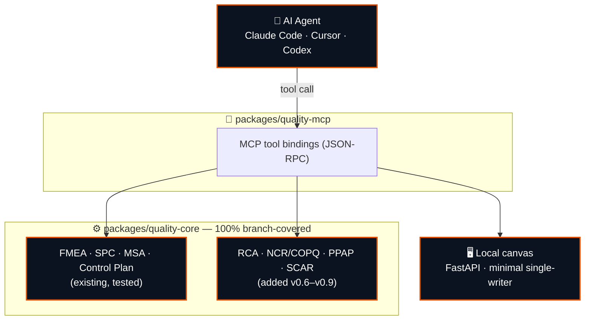

<!-- ░░░░░░░░░░░░░░░░░░░░░░░░░░░░░░░░  HEADER  ░░░░░░░░░░░░░░░░░░░░░░░░░░░░░░░░ -->


<div align="center">


<br>

[](https://github.com/Siddardth7/quality-engineering-skills/actions/workflows/ci.yml)
[](#-the-quality-gate)

[](.python-version)
[](https://github.com/astral-sh/uv)
[](https://github.com/astral-sh/ruff)
[](https://mypy-lang.org/)
[](https://modelcontextprotocol.io)

<br>

**AI agent skills for manufacturing quality engineering, backed by deterministic, unit-tested Python calculation engines.**<br>The AI reasons about methodology; the engine does the exact math — so Cp/Cpk, Gage R&R, and Action Priority are never hallucinated.

<br>

<a href="Idea.md"></a>
&nbsp;
<a href="ROADMAP.md"></a>
&nbsp;
<a href="Execution.md"></a>
&nbsp;
<a href="CHANGELOG.md"></a>

</div>

---

## 🔎 What this is

Manufacturing quality engineers work in AIAG / IATF-16949 tools — **FMEA, SPC, MSA, Control Plans, 8D, PPAP, auditing** — mostly in spreadsheets and disconnected apps. AI assistants reason about these methodologies well, but **LLMs asked to compute statistics in prompt memory hallucinate the math**: they miscalculate Cp/Cpk, draw invalid control limits, and get Action Priority ratings wrong.

This project fixes that with a strict split:

- **🧠 AI Agent Skills** (`agentskills.io` markdown) guide the *qualitative* reasoning — structuring a 7-step FMEA, building a reversible 5-Why chain, phrasing an ISO 9001 §8.7 non-conformance.
- **⚙️ Deterministic engines** (`packages/quality-core`, 100% branch-covered Python) do *every* calculation — control limits, Western Electric rules, ANOVA Gage R&R, the AIAG-VDA AP table.
- **🔌 An MCP server** (`packages/quality-mcp`) exposes those engines to Claude Code, Cursor, and Codex as native tools, so the agent *calls* verified math instead of guessing it.
- **🖥️ A minimal local canvas** renders the charts and grids.

Local-first: no cloud backend, works directly on local CSV / Excel / JSON files.

> **Engine source.** This repo reuses the tested FMEA, SPC, MSA, and Control Plan engines from [`quality-platform`](https://github.com/Siddardth7/quality-platform) as its deterministic core, and builds the skill / MCP / canvas layers on top. Full vision in **[Idea.md](Idea.md)**.

---

## 🗺️ The plan

`v0.1` platform + MCP setup → `v0.2–v0.5` wrap the four existing engines → `v0.6–v0.9` one new high-ROI domain per version → `v1.0` hardening.

```
v0.1.0 ─► v0.2.0 ─► v0.3.0 ─► v0.4.0 ─► v0.5.0 ─► v0.6.0 ─► v0.7.0 ─► v0.8.0 ─► v0.9.0 ─► v1.0.0
Setup     FMEA      SPC       MSA      Control    RCA       NCR &     PPAP      Supplier   Production
& MCP     via MCP   via MCP   via MCP  Plan       Suite     COPQ      Core      SCAR       Hardening
```

| Milestone | Theme | Status | Milestone Index |
| :--- | :--- | :--- | :--- |
| **v0.1.0** | Platform Setup & MCP Foundation | ✅ **Completed** | [docs/milestones/v0.1.0.md](docs/milestones/v0.1.0.md) |
| **v0.2.0** | FMEA Engine & Action Priority Skill | ✅ **Completed** | [docs/milestones/v0.2.0.md](docs/milestones/v0.2.0.md) |
| **v0.3.0** | SPC Engine & Control Chart Skill | ✅ **Completed** | [docs/milestones/v0.3.0.md](docs/milestones/v0.3.0.md) |
| **v0.4.0** | MSA Engine & Gage R&R Skill | ✅ **Completed** | [docs/milestones/v0.4.0.md](docs/milestones/v0.4.0.md) |
| **v0.5.0** | Control Plan Engine via MCP (4-Engine Checkpoint) | ✅ **Completed** | [docs/milestones/v0.5.0.md](docs/milestones/v0.5.0.md) |
| **v0.6.0** | RCA Suite (5-Why, Fishbone, Is/Is-Not) | ⏳ **Up Next** | Planned |
| **v0.7.0–v1.0.0** | Extended Engines, Canvas UI & Release | ⏳ Queued | Planned |

Everything else — 8D, APQP/DVP&R, full ISO/IATF + VDA 6.3 audit, OEM CSR overlays, desktop packaging — is the named **v2 backlog** in **[ROADMAP.md](ROADMAP.md)**. Versions are milestone-driven, not date-driven.

---

## 🏗️ Architecture

A **uv workspace monorepo**. The deterministic core is written once in `quality_core` and consumed by everything above it. Imports go downward only — CI enforces that no UI dependency ever leaks into the core.



The deterministic engines live in `quality-core`; the MCP / skill path exposes them to AI hosts. Engines not yet in `quality-core` are extracted from the source quality-platform repo per milestone (see **[ROADMAP.md](ROADMAP.md)**) — this repo does not vendor the old Streamlit apps.

---

## 🚀 Quickstart

```bash
# 1 · clone
git clone https://github.com/Siddardth7/quality-engineering-skills.git
cd quality-engineering-skills

# 2 · install the locked workspace
uv sync --frozen

# 3 · run the test suite
uv run pytest -q
```

The MCP server and canvas entry points land in `v0.1.0`–`v0.2.0` — see **[ROADMAP.md](ROADMAP.md)**. To connect AI host clients (Claude Code, Cursor) to `quality-mcp`, see **[docs/mcp-client-setup.md](docs/mcp-client-setup.md)**.

---

## 🛡️ The quality gate

One bar across the workspace, enforced locally and in CI (`.github/workflows/ci.yml`) on every push and PR to `test` and `main`:

```bash
uv run ruff check .     # lint + format
uv run mypy             # strict static types
uv run pip-audit        # dependency vulnerability audit
```

Plus a **core dependency contract** (no UI chain in `quality-core` or `quality-mcp`) and two **100%** line+branch coverage gates — `quality-core` (io / schema / scoring / spc) and `quality-mcp` — followed by the `tests/` governance suites. Each suite runs once. Every new engine module added in `v0.6`–`v0.9` ships with its own gate, in the same style.

> **Standards fidelity.** Every AIAG / ISO / VDA constant, threshold, and quotation is cited in that domain's `docs/ASSUMPTIONS_LOG.md`, verified against the licensed reference manual — never against a web search.

---

## 📁 Repository layout

```
quality-engineering-skills/
├── Idea.md · ROADMAP.md · Execution.md   # planning
├── packages/
│   ├── quality-core/     # shared deterministic engines  → import quality_core
│   └── quality-mcp/      # MCP tool bindings (v0.1.0+)
├── skills/               # agentskills.io markdown skills (added per version)
├── docs/milestones/      # per-release milestone index + specs
└── .claude/              # ship pipeline agents + commands
```

---

## 🔀 Branch & release flow

`feature → test → main`. Feature branches are based on `origin/test`; the ship pipeline opens a PR into `test`. A version ships by promoting `test → main` at a milestone boundary and tagging it, with SME sign-off. Full operating rules in **[CLAUDE.md](CLAUDE.md)**.

<div align="center">
<sub>Manufacturing-quality engineering, built like software — typed, tested, and shipped as milestones.</sub>


</div>
