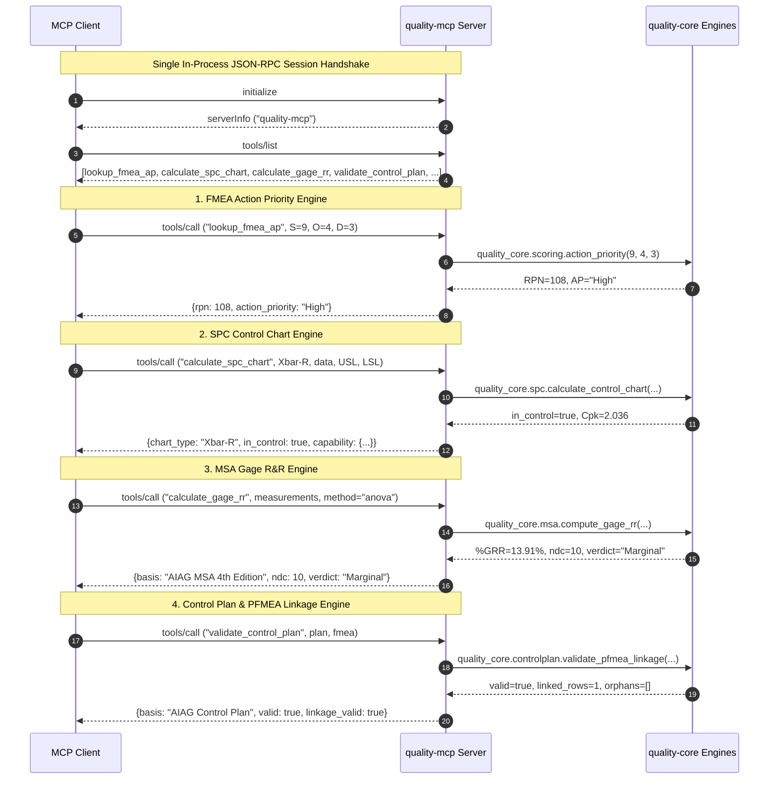
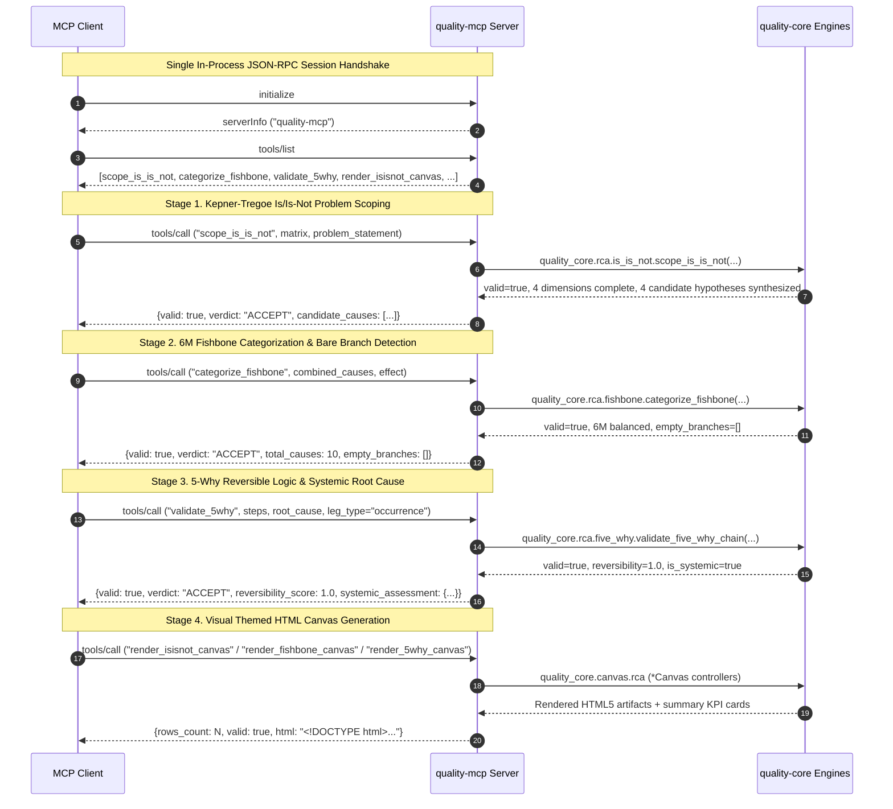
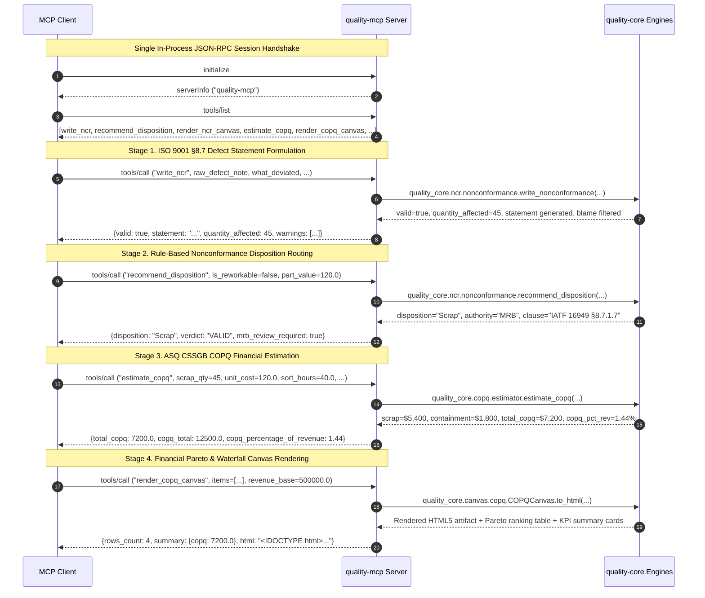

# Model Context Protocol (MCP) Client Setup

This guide details how to configure Model Context Protocol (MCP) clients—including Claude Code, Cursor, and other MCP-compliant hosts—to communicate with `quality-mcp`.

`quality-mcp` exposes the deterministic quality engineering engines in `quality-core` (Statistical Process Control, Measurement System Analysis, FMEA risk scoring, Control Plans) as callable MCP tools over standard transports.

---

## 1. Prerequisites

Before connecting an MCP client to `quality-mcp`:

1. **Python 3.11+** installed on your system.
2. **`uv` package manager** installed (`curl -LsSf https://astral.sh/uv/install.sh | sh` or `brew install uv`).
3. **Workspace dependencies installed**:
   ```bash
   uv sync --frozen
   ```
   This installs the workspace packages and registers the `quality-mcp` console script in the local `.venv`.

---

## 2. Configuration

### Automatic Discovery via `.mcp.json`

The repository root includes a standard [`.mcp.json`](../.mcp.json) configuration file:

```json
{
  "mcpServers": {
    "quality-mcp": {
      "command": "uv",
      "args": [
        "run",
        "quality-mcp"
      ]
    }
  }
}
```

MCP hosts that recognize repository-level `.mcp.json` files (such as Claude Code and Cursor) will discover and load the `quality-mcp` server automatically when opening this workspace.

---

### Claude Code Setup

Claude Code automatically detects [`.mcp.json`](../.mcp.json) in the workspace root. Alternatively, you can configure it explicitly using the Claude Code CLI or configuration files:

#### Option A: Project Configuration CLI
Run the following command from the repository root:
```bash
claude mcp add quality-mcp uv run quality-mcp
```

#### Option B: User Configuration (`~/.claude.json`)
To make `quality-mcp` available across workspaces, add the server to your global configuration with the absolute workspace directory:
```json
{
  "mcpServers": {
    "quality-mcp": {
      "command": "uv",
      "args": [
        "--directory",
        "/absolute/path/to/quality-engineering-skills",
        "run",
        "quality-mcp"
      ]
    }
  }
}
```

---

### Cursor Setup

Cursor supports MCP servers configured via workspace settings or global configuration:

#### Option A: Workspace Settings (`.cursor/mcp.json`)
Create or edit `.cursor/mcp.json` in the workspace root:
```json
{
  "mcpServers": {
    "quality-mcp": {
      "command": "uv",
      "args": [
        "run",
        "quality-mcp"
      ]
    }
  }
}
```

#### Option B: Cursor Settings UI
1. Open **Cursor Settings** (`Cmd+,` / `Ctrl+,`).
2. Navigate to **Features** > **MCP**.
3. Click **+ Add New MCP Server**.
4. Configure:
   - **Name**: `quality-mcp`
   - **Type**: `command`
   - **Command**: `uv run quality-mcp` (run from the workspace root).

---

## 3. Testing and Verification

### In-Process Round-Trip Suites
The automated test suites exercise MCP client-server protocol lifecycles (`initialize`, `tools/list`, and `tools/call`) using in-process memory transports:

1. **Ping Health Check Round-Trip**:
   ```bash
   uv run pytest packages/quality-mcp/tests/test_client_roundtrip.py -v
   ```

2. **FMEA Action Priority Round-Trip**:
   ```bash
   uv run pytest packages/quality-mcp/tests/test_fmea_client_roundtrip.py -v
   ```
   Validates session handshake, tool discovery of `lookup_fmea_ap`, round-trip evaluation against 12 real-world automotive DFMEA/PFMEA failure modes across High/Medium/Low Action Priority, dual structured and serialized payload parity against `quality_core.scoring`, and protocol-level negative controls for out-of-range integer scores, non-integer types, and unknown tools.

3. **SPC Client-Server Round-Trip**:
   ```bash
   uv run pytest packages/quality-mcp/tests/test_spc_client_roundtrip.py -v
   ```
   Validates in-process JSON-RPC execution of `calculate_spc_chart` across AIAG benchmark datasets (Xbar-R shaft diameters, I-MR coating thickness, attribute p/c charts), asserts dual-payload parity against `quality_core.spc`, verifies stability-gated capability withholding on out-of-control processes over the wire, and validates protocol-level error handling.

4. **MSA Client-Server Round-Trip**:
   ```bash
   uv run pytest packages/quality-mcp/tests/test_msa_client_roundtrip.py -v
   ```
   Validates in-process JSON-RPC execution of `calculate_gage_rr` across AIAG MSA 4th Edition benchmark datasets (10x3x3 crossed study case 1 and Example B), asserts dual-payload parity against `quality_core.msa`, verifies exact ANOVA and Average-and-Range decomposition parity against extracted reference fixtures, and validates protocol-level negative controls.

5. **Control Plan Client-Server Round-Trip**:
   ```bash
   uv run pytest packages/quality-mcp/tests/test_controlplan_client_roundtrip.py -v
   ```
   Validates in-process JSON-RPC execution of `validate_control_plan` across AIAG Control Plan benchmark datasets and FMEA fixtures, asserts dual-payload parity against `quality_core.controlplan`, verifies bidirectional PFMEA linkage, and checks protocol-level negative controls (orphan characteristics, tolerance inversions, malformed payloads).

6. **4-Engine Checkpoint Smoke Test (Milestone 5 Checkpoint)**:
   ```bash
   uv run pytest packages/quality-mcp/tests/test_four_engine_smoke.py -v
   ```
   Drives all four quality engineering tools (`lookup_fmea_ap`, `calculate_spc_chart`, `calculate_gage_rr`, `validate_control_plan`) through a **single** in-process FastMCP client session, verifying discovery, sequential execution without crosstalk, and independent error isolation.

7. **RCA Client-Server Round-Trip (Milestone 6 Checkpoint)**:
   ```bash
   uv run pytest packages/quality-mcp/tests/test_rca_client_roundtrip.py -v
   ```
   Validates in-process JSON-RPC execution of all six Root Cause Analysis (RCA) tools (`validate_5why`, `categorize_fishbone`, `scope_is_is_not`, `render_5why_canvas`, `render_fishbone_canvas`, `render_isisnot_canvas`), asserts dual-payload parity against `quality_core.rca` and `quality_core.canvas.rca`, executes real-world benchmark datasets (Sentinel-8D Pneumatic Cylinder & Ford Global 8D bearing induction), verifies multi-method chained workflow execution across a single session without state pollution, and validates protocol-level negative controls.

8. **Unified NCR & COPQ Client-Server Round-Trip (Milestone 7 Checkpoint)**:
   ```bash
   uv run pytest packages/quality-mcp/tests/test_ncr_copq_client_roundtrip.py -v
   ```
   Validates in-process JSON-RPC execution of all five Nonconformance Reporting (NCR) and Cost of Poor Quality (COPQ) tools (`write_ncr`, `recommend_disposition`, `render_ncr_canvas`, `estimate_copq`, `render_copq_canvas`), asserts dual-payload parity against `quality_core.ncr` and `quality_core.copq`, executes real-world benchmark manufacturing datasets (Cylinder Bore Honing Porosity, Connecting Rod Pin Bore Rework, Turbocharger Seal Warranty Escapes), verifies multi-tool chained workflow execution (`write_ncr` -> `recommend_disposition` -> `estimate_copq` -> `render_copq_canvas`) across a single session without state pollution, and validates session error isolation and protocol-level negative controls.

### Coverage Gate
Run the full 100% line and branch coverage gate for `quality-mcp`:
```bash
uv run pytest packages/quality-mcp --cov=quality_mcp --cov-report=term-missing --cov-fail-under=100
```

---

## 4. Verified JSON-RPC Protocol Transcript

Below is a verified JSON-RPC 2.0 message exchange showing client initialization, tool discovery, and tool execution against `quality-mcp`.

### 4.1 Initialization (`initialize`)

**Client Request:**
```json
{
  "jsonrpc": "2.0",
  "id": 1,
  "method": "initialize",
  "params": {
    "protocolVersion": "2025-11-25",
    "capabilities": {
      "roots": {
        "listChanged": true
      }
    },
    "clientInfo": {
      "name": "mcp-client",
      "version": "1.0.0"
    }
  }
}
```

**Server Response:**
```json
{
  "jsonrpc": "2.0",
  "id": 1,
  "result": {
    "protocolVersion": "2025-11-25",
    "capabilities": {
      "prompts": {
        "listChanged": false
      },
      "resources": {
        "subscribe": false,
        "listChanged": false
      },
      "tools": {
        "listChanged": false
      }
    },
    "serverInfo": {
      "name": "quality-mcp",
      "version": "1.29.0"
    }
  }
}
```

**Client Notification:**
```json
{
  "jsonrpc": "2.0",
  "method": "notifications/initialized"
}
```

---

### 4.2 Tool Discovery (`tools/list`)

**Client Request:**
```json
{
  "jsonrpc": "2.0",
  "id": 2,
  "method": "tools/list",
  "params": {}
}
```

**Server Response:**
```json
{
  "jsonrpc": "2.0",
  "id": 2,
  "result": {
    "tools": [
      {
        "name": "ping",
        "description": "Health check endpoint confirming MCP server availability and version.",
        "inputSchema": {
          "type": "object",
          "title": "pingArguments",
          "properties": {}
        },
        "outputSchema": {
          "type": "object",
          "title": "pingDictOutput",
          "additionalProperties": {
            "type": "string"
          }
        }
      },
      {
        "name": "lookup_fmea_ap",
        "description": "Look up AIAG-VDA 2019 Action Priority and calculate RPN for an FMEA item.",
        "inputSchema": {
          "type": "object",
          "title": "lookup_fmea_apArguments",
          "properties": {
            "severity": {
              "title": "Severity",
              "description": "Severity rating (1–10 on the AIAG-VDA scale)",
              "type": "integer"
            },
            "occurrence": {
              "title": "Occurrence",
              "description": "Occurrence rating (1–10 on the AIAG-VDA scale)",
              "type": "integer"
            },
            "detection": {
              "title": "Detection",
              "description": "Detection rating (1–10 on the AIAG-VDA scale)",
              "type": "integer"
            }
          },
          "required": [
            "severity",
            "occurrence",
            "detection"
          ]
        }
      }
    ]
  }
}
```

---

### 4.3 Tool Invocation (`tools/call` -> `ping`)

**Client Request:**
```json
{
  "jsonrpc": "2.0",
  "id": 3,
  "method": "tools/call",
  "params": {
    "name": "ping",
    "arguments": {}
  }
}
```

**Server Response:**
```json
{
  "jsonrpc": "2.0",
  "id": 3,
  "result": {
    "content": [
      {
        "type": "text",
        "text": "{\n  \"status\": \"ok\",\n  \"server\": \"quality-mcp\",\n  \"version\": \"0.1.0\"\n}"
      }
    ],
    "structuredContent": {
      "status": "ok",
      "server": "quality-mcp",
      "version": "0.1.0"
    },
    "isError": false
  }
}
```

---

### 4.4 Tool Invocation (`tools/call` -> `lookup_fmea_ap` Success)

**Client Request:**
```json
{
  "jsonrpc": "2.0",
  "id": 4,
  "method": "tools/call",
  "params": {
    "name": "lookup_fmea_ap",
    "arguments": {
      "severity": 10,
      "occurrence": 4,
      "detection": 4
    }
  }
}
```

**Server Response:**
```json
{
  "jsonrpc": "2.0",
  "id": 4,
  "result": {
    "content": [
      {
        "type": "text",
        "text": "{\n  \"severity\": 10,\n  \"occurrence\": 4,\n  \"detection\": 4,\n  \"rpn\": 160,\n  \"action_priority\": \"High\"\n}"
      }
    ],
    "structuredContent": {
      "severity": 10,
      "occurrence": 4,
      "detection": 4,
      "rpn": 160,
      "action_priority": "High"
    },
    "isError": false
  }
}
```

---

### 4.5 Tool Invocation (`tools/call` -> `lookup_fmea_ap` Validation Error)

**Client Request:**
```json
{
  "jsonrpc": "2.0",
  "id": 5,
  "method": "tools/call",
  "params": {
    "name": "lookup_fmea_ap",
    "arguments": {
      "severity": 11,
      "occurrence": 5,
      "detection": 5
    }
  }
}
```

**Server Response:**
```json
{
  "jsonrpc": "2.0",
  "id": 5,
  "result": {
    "content": [
      {
        "type": "text",
        "text": "Error executing tool lookup_fmea_ap: Severity score 11 is out of range. Valid range is 1–10 (AIAG-VDA scale)."
      }
    ],
    "isError": true
  }
}
```

---

### 4.6 Tool Invocation (`tools/call` -> `calculate_spc_chart` In-Control Xbar-R Success)

**Client Request:**
```json
{
  "jsonrpc": "2.0",
  "id": 6,
  "method": "tools/call",
  "params": {
    "name": "calculate_spc_chart",
    "arguments": {
      "chart_type": "Xbar-R",
      "data": [
        [10.1, 10.0, 9.9, 10.2, 9.8],
        [9.9, 10.1, 10.0, 10.0, 10.1],
        [10.2, 9.8, 10.1, 9.9, 10.0],
        [10.0, 10.0, 10.1, 10.2, 9.9]
      ],
      "usl": 11.0,
      "lsl": 9.0
    }
  }
}
```

**Server Response:**
```json
{
  "jsonrpc": "2.0",
  "id": 6,
  "result": {
    "content": [
      {
        "type": "text",
        "text": "{\n  \"chart_type\": \"Xbar-R\",\n  \"basis\": \"AIAG SPC 4th Edition\",\n  \"center_line\": 10.015,\n  \"ucl\": 10.232,\n  \"lcl\": 9.798,\n  \"dispersion_center\": 0.375,\n  \"ucl_dispersion\": 0.793,\n  \"lcl_dispersion\": 0.0,\n  \"sigma_hat\": 0.1612,\n  \"points\": [10.0, 10.02, 10.0, 10.04],\n  \"dispersion_points\": [0.4, 0.2, 0.4, 0.5],\n  \"violations\": [],\n  \"in_control\": true,\n  \"stable\": true,\n  \"stability_note\": null,\n  \"capability\": {\n    \"cp\": 2.067,\n    \"cpk\": 2.036,\n    \"pp\": 2.085,\n    \"ppk\": 2.054,\n    \"mean\": 10.015,\n    \"sigma_hat\": 0.1612,\n    \"sigma_overall\": 0.1599,\n    \"n\": 20,\n    \"alpha\": 0.05,\n    \"pp_ci\": [1.534, 2.834],\n    \"ppk_ci\": [1.442, 2.666],\n    \"ppk_lower\": 1.543,\n    \"ci_estimator\": \"Bissell (1990) approximate\",\n    \"ci_df\": 19\n  }\n}"
      }
    ],
    "structuredContent": {
      "chart_type": "Xbar-R",
      "basis": "AIAG SPC 4th Edition",
      "center_line": 10.015,
      "ucl": 10.232,
      "lcl": 9.798,
      "dispersion_center": 0.375,
      "ucl_dispersion": 0.793,
      "lcl_dispersion": 0.0,
      "sigma_hat": 0.1612,
      "points": [10.0, 10.02, 10.0, 10.04],
      "dispersion_points": [0.4, 0.2, 0.4, 0.5],
      "violations": [],
      "in_control": true,
      "stable": true,
      "stability_note": null,
      "capability": {
        "cp": 2.067,
        "cpk": 2.036,
        "pp": 2.085,
        "ppk": 2.054,
        "mean": 10.015,
        "sigma_hat": 0.1612,
        "sigma_overall": 0.1599,
        "n": 20,
        "alpha": 0.05,
        "pp_ci": [1.534, 2.834],
        "ppk_ci": [1.442, 2.666],
        "ppk_lower": 1.543,
        "ci_estimator": "Bissell (1990) approximate",
        "ci_df": 19
      }
    },
    "isError": false
  }
}
```

---

### 4.7 Tool Invocation (`tools/call` -> `calculate_spc_chart` Out-of-Control Stability Gate Suppression)

**Client Request:**
```json
{
  "jsonrpc": "2.0",
  "id": 7,
  "method": "tools/call",
  "params": {
    "name": "calculate_spc_chart",
    "arguments": {
      "chart_type": "Xbar-R",
      "data": [
        [10.1, 10.0, 9.9, 10.2, 9.8],
        [9.9, 10.1, 10.0, 10.0, 10.1],
        [10.2, 9.8, 10.1, 9.9, 10.0],
        [15.0, 15.5, 14.8, 15.2, 15.1]
      ],
      "usl": 16.0,
      "lsl": 8.0
    }
  }
}
```

**Server Response:**
```json
{
  "jsonrpc": "2.0",
  "id": 7,
  "result": {
    "content": [
      {
        "type": "text",
        "text": "{\n  \"chart_type\": \"Xbar-R\",\n  \"basis\": \"AIAG SPC 4th Edition\",\n  \"center_line\": 11.305,\n  \"ucl\": 11.564,\n  \"lcl\": 11.046,\n  \"dispersion_center\": 0.45,\n  \"ucl_dispersion\": 0.951,\n  \"lcl_dispersion\": 0.0,\n  \"sigma_hat\": 0.1935,\n  \"points\": [10.0, 10.02, 10.0, 15.2],\n  \"dispersion_points\": [0.4, 0.2, 0.4, 0.8],\n  \"violations\": [\n    {\n      \"point_index\": 3,\n      \"rule\": \"Western Electric Rule 1 (beyond 3-sigma)\",\n      \"value\": 15.2,\n      \"center_line\": 11.305,\n      \"ucl\": 11.564,\n      \"lcl\": 11.046\n    }\n  ],\n  \"in_control\": false,\n  \"stable\": false,\n  \"stability_note\": \"Process is not in statistical control — 1 out-of-control signal(s) detected on the control chart. Capability indices (Cp/Cpk/Pp/Ppk) are not a valid capability claim until the process is stabilized; treat these values as indicative only.\",\n  \"capability\": null\n}"
      }
    ],
    "structuredContent": {
      "chart_type": "Xbar-R",
      "basis": "AIAG SPC 4th Edition",
      "center_line": 11.305,
      "ucl": 11.564,
      "lcl": 11.046,
      "dispersion_center": 0.45,
      "ucl_dispersion": 0.951,
      "lcl_dispersion": 0.0,
      "sigma_hat": 0.1935,
      "points": [10.0, 10.02, 10.0, 15.2],
      "dispersion_points": [0.4, 0.2, 0.4, 0.8],
      "violations": [
        {
          "point_index": 3,
          "rule": "Western Electric Rule 1 (beyond 3-sigma)",
          "value": 15.2,
          "center_line": 11.305,
          "ucl": 11.564,
          "lcl": 11.046
        }
      ],
      "in_control": false,
      "stable": false,
      "stability_note": "Process is not in statistical control — 1 out-of-control signal(s) detected on the control chart. Capability indices (Cp/Cpk/Pp/Ppk) are not a valid capability claim until the process is stabilized; treat these values as indicative only.",
      "capability": null
    },
    "isError": false
  }
}
```

---

### 4.8 Tool Invocation (`tools/call` -> `calculate_spc_chart` Validation Error)

**Client Request:**
```json
{
  "jsonrpc": "2.0",
  "id": 8,
  "method": "tools/call",
  "params": {
    "name": "calculate_spc_chart",
    "arguments": {
      "chart_type": "Xbar-R",
      "data": [
        [10.1, 10.0],
        [9.9, 10.1]
      ],
      "usl": 9.0,
      "lsl": 11.0
    }
  }
}
```

**Server Response:**
```json
{
  "jsonrpc": "2.0",
  "id": 8,
  "result": {
    "content": [
      {
        "type": "text",
        "text": "Error executing tool calculate_spc_chart: USL cannot be less than LSL."
      }
    ],
    "isError": true
  }
}
```

---

### 4.9 Tool Invocation (`tools/call` -> `calculate_gage_rr` ANOVA Success)

**Client Request:**
```json
{
  "jsonrpc": "2.0",
  "id": 9,
  "method": "tools/call",
  "params": {
    "name": "calculate_gage_rr",
    "arguments": {
      "measurements": [
        {"part": "P1", "appraiser": "A", "trial": 1, "measurement": 2.0},
        {"part": "P1", "appraiser": "A", "trial": 2, "measurement": 2.2},
        {"part": "P1", "appraiser": "B", "trial": 1, "measurement": 2.5},
        {"part": "P1", "appraiser": "B", "trial": 2, "measurement": 2.5},
        {"part": "P2", "appraiser": "A", "trial": 1, "measurement": 4.0},
        {"part": "P2", "appraiser": "A", "trial": 2, "measurement": 4.2},
        {"part": "P2", "appraiser": "B", "trial": 1, "measurement": 4.5},
        {"part": "P2", "appraiser": "B", "trial": 2, "measurement": 4.5},
        {"part": "P3", "appraiser": "A", "trial": 1, "measurement": 6.0},
        {"part": "P3", "appraiser": "A", "trial": 2, "measurement": 6.2},
        {"part": "P3", "appraiser": "B", "trial": 1, "measurement": 6.5},
        {"part": "P3", "appraiser": "B", "trial": 2, "measurement": 6.5}
      ],
      "method": "anova",
      "tolerance": 8.0
    }
  }
}
```

**Server Response:**
```json
{
  "jsonrpc": "2.0",
  "id": 9,
  "result": {
    "content": [
      {
        "type": "text",
        "text": "{\n  \"basis\": \"AIAG MSA 4th Edition\",\n  \"ev\": 0.0866,\n  \"av\": 0.2806,\n  \"grr\": 0.2937,\n  \"pv\": 2.0917,\n  \"tv\": 2.1122,\n  \"mean\": 4.1417,\n  \"pev_study\": 4.1005,\n  \"pav_study\": 13.2861,\n  \"pgrr_study\": 13.9056,\n  \"ppv_study\": 99.0285,\n  \"pev_tolerance\": 6.4952,\n  \"pav_tolerance\": 21.0468,\n  \"pgrr_tolerance\": 22.0283,\n  \"ppv_tolerance\": 156.8746,\n  \"ndc\": 10,\n  \"verdict\": \"Marginal\",\n  \"n_parts\": 3,\n  \"n_appraisers\": 2,\n  \"n_trials\": 2,\n  \"is_balanced\": true,\n  \"method\": \"anova\",\n  \"method_note\": \"ANOVA method (crossed two-factor with replication): the part x appraiser interaction IS estimated and tested. AIAG MSA 4th Ed., Ch. III Sec. B / Appendix A. When the interaction F statistic falls below its critical value \\\"the interaction term is pooled with the equipment (error) term\\\" and the interaction is reported as 0; when it does not, GRR = sqrt(EV^2 + AV^2 + INT^2) carries the interaction. The F-test uses alpha = 0.05, the level footnoted in the manual's own worked example (Table A 4); AIAG does not mandate a significance level. Negative variance components are set to zero, per Appendix A.\",\n  \"interaction\": 0.0,\n  \"interaction_f\": 0.0,\n  \"interaction_significant\": false\n}"
      }
    ],
    "structuredContent": {
      "basis": "AIAG MSA 4th Edition",
      "ev": 0.0866,
      "av": 0.2806,
      "grr": 0.2937,
      "pv": 2.0917,
      "tv": 2.1122,
      "mean": 4.1417,
      "pev_study": 4.1005,
      "pav_study": 13.2861,
      "pgrr_study": 13.9056,
      "ppv_study": 99.0285,
      "pev_tolerance": 6.4952,
      "pav_tolerance": 21.0468,
      "pgrr_tolerance": 22.0283,
      "ppv_tolerance": 156.8746,
      "ndc": 10,
      "verdict": "Marginal",
      "n_parts": 3,
      "n_appraisers": 2,
      "n_trials": 2,
      "is_balanced": true,
      "method": "anova",
      "method_note": "ANOVA method (crossed two-factor with replication): the part x appraiser interaction IS estimated and tested. AIAG MSA 4th Ed., Ch. III Sec. B / Appendix A. When the interaction F statistic falls below its critical value \"the interaction term is pooled with the equipment (error) term\" and the interaction is reported as 0; when it does not, GRR = sqrt(EV^2 + AV^2 + INT^2) carries the interaction. The F-test uses alpha = 0.05, the level footnoted in the manual's own worked example (Table A 4); AIAG does not mandate a significance level. Negative variance components are set to zero, per Appendix A.",
      "interaction": 0.0,
      "interaction_f": 0.0,
      "interaction_significant": false
    },
    "isError": false
  }
}
```

---

### 4.10 Tool Invocation (`tools/call` -> `calculate_gage_rr` Average-and-Range Success)

**Client Request:**
```json
{
  "jsonrpc": "2.0",
  "id": 10,
  "method": "tools/call",
  "params": {
    "name": "calculate_gage_rr",
    "arguments": {
      "measurements": [
        {"part": "P1", "appraiser": "A", "trial": 1, "measurement": 2.0},
        {"part": "P1", "appraiser": "A", "trial": 2, "measurement": 2.2},
        {"part": "P1", "appraiser": "B", "trial": 1, "measurement": 2.5},
        {"part": "P1", "appraiser": "B", "trial": 2, "measurement": 2.5},
        {"part": "P2", "appraiser": "A", "trial": 1, "measurement": 4.0},
        {"part": "P2", "appraiser": "A", "trial": 2, "measurement": 4.2},
        {"part": "P2", "appraiser": "B", "trial": 1, "measurement": 4.5},
        {"part": "P2", "appraiser": "B", "trial": 2, "measurement": 4.5},
        {"part": "P3", "appraiser": "A", "trial": 1, "measurement": 6.0},
        {"part": "P3", "appraiser": "A", "trial": 2, "measurement": 6.2},
        {"part": "P3", "appraiser": "B", "trial": 1, "measurement": 6.5},
        {"part": "P3", "appraiser": "B", "trial": 2, "measurement": 6.5}
      ],
      "method": "average_and_range"
    }
  }
}
```

**Server Response:**
```json
{
  "jsonrpc": "2.0",
  "id": 10,
  "result": {
    "content": [
      {
        "type": "text",
        "text": "{\n  \"basis\": \"AIAG MSA 4th Edition\",\n  \"ev\": 0.0886,\n  \"av\": 0.2805,\n  \"grr\": 0.2942,\n  \"pv\": 2.0924,\n  \"tv\": 2.1130,\n  \"mean\": 4.1417,\n  \"pev_study\": 4.1941,\n  \"pav_study\": 13.2758,\n  \"pgrr_study\": 13.9226,\n  \"ppv_study\": 99.0260,\n  \"pev_tolerance\": null,\n  \"pav_tolerance\": null,\n  \"pgrr_tolerance\": null,\n  \"ppv_tolerance\": null,\n  \"ndc\": 10,\n  \"verdict\": \"Marginal\",\n  \"n_parts\": 3,\n  \"n_appraisers\": 2,\n  \"n_trials\": 2,\n  \"is_balanced\": true,\n  \"method\": \"average_and_range\",\n  \"method_note\": \"Average-and-Range method: the part x appraiser interaction is NOT estimated. AIAG MSA 4th Ed., Ch. III Sec. B: the Average and Range method \\\"does not include\\\" the operator-to-part interaction, which is therefore absorbed into the reported components; %GRR is biased low when that interaction is non-zero. ANOVA (which separates it) is available via method=\\\"anova\\\".\",\n  \"interaction\": null,\n  \"interaction_f\": null,\n  \"interaction_significant\": null\n}"
      }
    ],
    "structuredContent": {
      "basis": "AIAG MSA 4th Edition",
      "ev": 0.0886,
      "av": 0.2805,
      "grr": 0.2942,
      "pv": 2.0924,
      "tv": 2.1130,
      "mean": 4.1417,
      "pev_study": 4.1941,
      "pav_study": 13.2758,
      "pgrr_study": 13.9226,
      "ppv_study": 99.0260,
      "pev_tolerance": null,
      "pav_tolerance": null,
      "pgrr_tolerance": null,
      "ppv_tolerance": null,
      "ndc": 10,
      "verdict": "Marginal",
      "n_parts": 3,
      "n_appraisers": 2,
      "n_trials": 2,
      "is_balanced": true,
      "method": "average_and_range",
      "method_note": "Average-and-Range method: the part x appraiser interaction is NOT estimated. AIAG MSA 4th Ed., Ch. III Sec. B: the Average and Range method \"does not include\" the operator-to-part interaction, which is therefore absorbed into the reported components; %GRR is biased low when that interaction is non-zero. ANOVA (which separates it) is available via method=\"anova\".",
      "interaction": null,
      "interaction_f": null,
      "interaction_significant": null
    },
    "isError": false
  }
}
```

---

### 4.11 Tool Invocation (`tools/call` -> `calculate_gage_rr` Validation Error)

**Client Request:**
```json
{
  "jsonrpc": "2.0",
  "id": 11,
  "method": "tools/call",
  "params": {
    "name": "calculate_gage_rr",
    "arguments": {
      "measurements": [
        {"part": "P1", "appraiser": "A", "trial": 1, "measurement": 2.0},
        {"part": "P1", "appraiser": "A", "trial": 2, "measurement": 2.2},
        {"part": "P1", "appraiser": "A", "trial": 3, "measurement": 2.1},
        {"part": "P1", "appraiser": "B", "trial": 1, "measurement": 2.5},
        {"part": "P1", "appraiser": "B", "trial": 2, "measurement": 2.5}
      ]
    }
  }
}
```

**Server Response:**
```json
{
  "jsonrpc": "2.0",
  "id": 11,
  "result": {
    "content": [
      {
        "type": "text",
        "text": "Error executing tool calculate_gage_rr: Data is unbalanced. This Gage R&R engine requires equal trials per (part, appraiser) cell. Found 2–3 trials across cells."
      }
    ],
    "isError": true
  }
}
```

---

### 4.12 Tool Invocation (`tools/call` -> `validate_control_plan` Success with PFMEA Linkage)

**Client Request:**
```json
{
  "jsonrpc": "2.0",
  "id": 12,
  "method": "tools/call",
  "params": {
    "name": "validate_control_plan",
    "arguments": {
      "plan": [
        {
          "characteristic": "Housing — Bore out of spec",
          "measurement_method": "Bore gauge",
          "sample_size": 5,
          "frequency": "per shift",
          "reaction_plan": "Contain and investigate.",
          "source_cause_id": "F1::F1-M1::F1-M1-C1"
        }
      ],
      "fmea": [
        {
          "ID": 1,
          "Process_Step": "Machining",
          "Component": "Housing",
          "Function": "Enclose piston",
          "Failure_Mode": "Bore out of spec",
          "Effect": "Piston seizure",
          "Severity": 9,
          "Cause": "Tool wear",
          "Occurrence": 4,
          "Current_Control": "Bore gauge",
          "Detection": 3
        }
      ]
    }
  }
}
```

**Server Response:**
```json
{
  "jsonrpc": "2.0",
  "id": 12,
  "result": {
    "content": [
      {
        "type": "text",
        "text": "{\n  \"basis\": \"AIAG Control Plan\",\n  \"valid\": true,\n  \"total_rows\": 1,\n  \"schema_valid\": true,\n  \"schema_findings\": [],\n  \"linkage_checked\": true,\n  \"linkage_valid\": true,\n  \"linked_rows\": 1,\n  \"orphan_characteristics\": [],\n  \"uncovered_failure_modes\": [],\n  \"linkage_findings\": []\n}"
      }
    ],
    "structuredContent": {
      "basis": "AIAG Control Plan",
      "valid": true,
      "total_rows": 1,
      "schema_valid": true,
      "schema_findings": [],
      "linkage_checked": true,
      "linkage_valid": true,
      "linked_rows": 1,
      "orphan_characteristics": [],
      "uncovered_failure_modes": [],
      "linkage_findings": []
    },
    "isError": false
  }
}
```

---

### 4.13 Tool Invocation (`tools/call` -> `validate_control_plan` Orphan Linkage Detection)

**Client Request:**
```json
{
  "jsonrpc": "2.0",
  "id": 13,
  "method": "tools/call",
  "params": {
    "name": "validate_control_plan",
    "arguments": {
      "plan": [
        {
          "characteristic": "Orphan Characteristic",
          "measurement_method": "Visual check",
          "sample_size": 1,
          "frequency": "per lot",
          "reaction_plan": "Segregate lot.",
          "source_cause_id": "F99::M99::C99"
        }
      ],
      "fmea": [
        {
          "ID": 1,
          "Process_Step": "Machining",
          "Component": "Housing",
          "Function": "Enclose piston",
          "Failure_Mode": "Bore out of spec",
          "Effect": "Piston seizure",
          "Severity": 9,
          "Cause": "Tool wear",
          "Occurrence": 4,
          "Current_Control": "Bore gauge",
          "Detection": 3
        }
      ]
    }
  }
}
```

**Server Response:**
```json
{
  "jsonrpc": "2.0",
  "id": 13,
  "result": {
    "content": [
      {
        "type": "text",
        "text": "{\n  \"basis\": \"AIAG Control Plan\",\n  \"valid\": false,\n  \"total_rows\": 1,\n  \"schema_valid\": true,\n  \"schema_findings\": [],\n  \"linkage_checked\": true,\n  \"linkage_valid\": false,\n  \"linked_rows\": 0,\n  \"orphan_characteristics\": [\n    \"Orphan Characteristic\"\n  ],\n  \"uncovered_failure_modes\": [\n    \"F1::F1-M1\"\n  ],\n  \"linkage_findings\": [\n    \"Orphan characteristic 'Orphan Characteristic': source_cause_id 'F99::M99::C99' does not exist in FMEA causes.\",\n    \"Uncovered FMEA failure mode 'F1::F1-M1' has no corresponding Control Plan row.\"\n  ]\n}"
      }
    ],
    "structuredContent": {
      "basis": "AIAG Control Plan",
      "valid": false,
      "total_rows": 1,
      "schema_valid": true,
      "schema_findings": [],
      "linkage_checked": true,
      "linkage_valid": false,
      "linked_rows": 0,
      "orphan_characteristics": [
        "Orphan Characteristic"
      ],
      "uncovered_failure_modes": [
        "F1::F1-M1"
      ],
      "linkage_findings": [
        "Orphan characteristic 'Orphan Characteristic': source_cause_id 'F99::M99::C99' does not exist in FMEA causes.",
        "Uncovered FMEA failure mode 'F1::F1-M1' has no corresponding Control Plan row."
      ]
    },
    "isError": false
  }
}
```

---

### 4.14 4-Engine Checkpoint Multi-Tool Session (FMEA + SPC + MSA + Control Plan)

The following sequence illustrates a single client session invoking all four deterministic quality engineering tools sequentially:



---

### 4.15 Tool Invocation (`tools/call` -> `scope_is_is_not` Sentinel-8D Scoping Success)

**Client Request:**
```json
{
  "jsonrpc": "2.0",
  "id": 15,
  "method": "tools/call",
  "params": {
    "name": "scope_is_is_not",
    "arguments": {
      "matrix": [
        {
          "dimension": "WHAT",
          "is_data": "Piston stroke binding and rod seal leakage (>50 sccm)",
          "is_not_data": "Barrel rupture, port thread damage, or tie rod failure",
          "distinctions": "Dynamic seal interface under 6 bar operating pressure",
          "changes": "Seal vendor batch change to polyurethane compound 90A"
        },
        {
          "dimension": "WHERE",
          "is_data": "Assembly Line 2 (Automated cell), front rod end gland",
          "is_not_data": "Assembly Line 1 (Manual cell), rear cap gland",
          "distinctions": "Line 2 uses high-speed pneumatic press for seal insertion",
          "changes": "Insertion press stroke speed increased by 25% on 2026-08-01"
        },
        {
          "dimension": "WHEN",
          "is_data": "First 100 cycles during end-of-line functional test",
          "is_not_data": "Static leak check at assembly or endurance testing (>10,000 cycles)",
          "distinctions": "Initial dynamic break-in under dry lubrication conditions",
          "changes": "Pre-lube grease specification changed from Krytox to standard PTFE"
        },
        {
          "dimension": "EXTENT",
          "is_data": "14 of 250 cylinders (5.6% reject rate), 120 sccm mean leak",
          "is_not_data": "100% defective or minor seepage (<10 sccm)",
          "distinctions": "Clustered on Shift 1 production lots with batch 90A seals",
          "changes": "Shift 1 tooling guide bushing wear detected (0.08 mm play)"
        }
      ],
      "problem_statement": "Pneumatic cylinder functional defect requiring assembly rework (stroke binding & seal leakage)"
    }
  }
}
```

**Server Response:**
```json
{
  "jsonrpc": "2.0",
  "id": 15,
  "result": {
    "content": [
      {
        "type": "text",
        "text": "{\n  \"basis\": \"Kepner & Tregoe (1997) / AIAG CQI-20 / Ford Global 8D\",\n  \"valid\": true,\n  \"verdict\": \"ACCEPT\",\n  \"problem_statement\": \"Pneumatic cylinder functional defect requiring assembly rework (stroke binding & seal leakage)\",\n  \"total_rows\": 4,\n  \"dimension_coverage\": {\n    \"WHAT\": true,\n    \"WHERE\": true,\n    \"WHEN\": true,\n    \"EXTENT\": true\n  },\n  \"complete_dimensions\": [\n    \"WHAT\",\n    \"WHERE\",\n    \"WHEN\",\n    \"EXTENT\"\n  ],\n  \"missing_dimensions\": [],\n  \"candidate_causes\": [\n    {\n      \"dimension\": \"WHAT\",\n      \"distinction\": \"Dynamic seal interface under 6 bar operating pressure\",\n      \"change\": \"Seal vendor batch change to polyurethane compound 90A\",\n      \"hypothesis\": \"Dynamic seal interface under 6 bar operating pressure caused by Seal vendor batch change to polyurethane compound 90A\",\n      \"is_paired\": true\n    },\n    {\n      \"dimension\": \"WHERE\",\n      \"distinction\": \"Line 2 uses high-speed pneumatic press for seal insertion\",\n      \"change\": \"Insertion press stroke speed increased by 25% on 2026-08-01\",\n      \"hypothesis\": \"Line 2 uses high-speed pneumatic press for seal insertion caused by Insertion press stroke speed increased by 25% on 2026-08-01\",\n      \"is_paired\": true\n    },\n    {\n      \"dimension\": \"WHEN\",\n      \"distinction\": \"Initial dynamic break-in under dry lubrication conditions\",\n      \"change\": \"Pre-lube grease specification changed from Krytox to standard PTFE\",\n      \"hypothesis\": \"Initial dynamic break-in under dry lubrication conditions caused by Pre-lube grease specification changed from Krytox to standard PTFE\",\n      \"is_paired\": true\n    },\n    {\n      \"dimension\": \"EXTENT\",\n      \"distinction\": \"Clustered on Shift 1 production lots with batch 90A seals\",\n      \"change\": \"Shift 1 tooling guide bushing wear detected (0.08 mm play)\",\n      \"hypothesis\": \"Clustered on Shift 1 production lots with batch 90A seals caused by Shift 1 tooling guide bushing wear detected (0.08 mm play)\",\n      \"is_paired\": true\n    }\n  ],\n  \"warnings\": [],\n  \"recommendations\": [\n    \"Problem boundary scoping is complete across all 4 Kepner-Tregoe dimensions (WHAT, WHERE, WHEN, EXTENT).\",\n    \"4 candidate root-cause hypotheses synthesized from paired distinctions and changes for downstream 6M Fishbone and 5-Why validation.\"\n  ]\n}"
      }
    ],
    "structuredContent": {
      "basis": "Kepner & Tregoe (1997) / AIAG CQI-20 / Ford Global 8D",
      "valid": true,
      "verdict": "ACCEPT",
      "problem_statement": "Pneumatic cylinder functional defect requiring assembly rework (stroke binding & seal leakage)",
      "total_rows": 4,
      "dimension_coverage": {
        "WHAT": true,
        "WHERE": true,
        "WHEN": true,
        "EXTENT": true
      },
      "complete_dimensions": [
        "WHAT",
        "WHERE",
        "WHEN",
        "EXTENT"
      ],
      "missing_dimensions": [],
      "candidate_causes": [
        {
          "dimension": "WHAT",
          "distinction": "Dynamic seal interface under 6 bar operating pressure",
          "change": "Seal vendor batch change to polyurethane compound 90A",
          "hypothesis": "Dynamic seal interface under 6 bar operating pressure caused by Seal vendor batch change to polyurethane compound 90A",
          "is_paired": true
        },
        {
          "dimension": "WHERE",
          "distinction": "Line 2 uses high-speed pneumatic press for seal insertion",
          "change": "Insertion press stroke speed increased by 25% on 2026-08-01",
          "hypothesis": "Line 2 uses high-speed pneumatic press for seal insertion caused by Insertion press stroke speed increased by 25% on 2026-08-01",
          "is_paired": true
        },
        {
          "dimension": "WHEN",
          "distinction": "Initial dynamic break-in under dry lubrication conditions",
          "change": "Pre-lube grease specification changed from Krytox to standard PTFE",
          "hypothesis": "Initial dynamic break-in under dry lubrication conditions caused by Pre-lube grease specification changed from Krytox to standard PTFE",
          "is_paired": true
        },
        {
          "dimension": "EXTENT",
          "distinction": "Clustered on Shift 1 production lots with batch 90A seals",
          "change": "Shift 1 tooling guide bushing wear detected (0.08 mm play)",
          "hypothesis": "Clustered on Shift 1 production lots with batch 90A seals caused by Shift 1 tooling guide bushing wear detected (0.08 mm play)",
          "is_paired": true
        }
      ],
      "warnings": [],
      "recommendations": [
        "Problem boundary scoping is complete across all 4 Kepner-Tregoe dimensions (WHAT, WHERE, WHEN, EXTENT).",
        "4 candidate root-cause hypotheses synthesized from paired distinctions and changes for downstream 6M Fishbone and 5-Why validation."
      ]
    },
    "isError": false
  }
}
```

---

### 4.16 Tool Invocation (`tools/call` -> `categorize_fishbone` 6M Categorization Success)

**Client Request:**
```json
{
  "jsonrpc": "2.0",
  "id": 16,
  "method": "tools/call",
  "params": {
    "name": "categorize_fishbone",
    "arguments": {
      "causes": [
        {"category": "Man", "cause": "Operator not trained on updated seal insertion procedure", "sub_category": "Training"},
        {"category": "Man", "cause": "Shift handover did not communicate bushing play warning", "sub_category": "Communication"},
        {"category": "Machine", "cause": "Guide bushing radial runout (0.08 mm play)", "sub_category": "Tooling"},
        {"category": "Machine", "cause": "Insertion press stroke speed excessive (350 mm/s)", "sub_category": "Equipment"},
        {"category": "Method", "cause": "Work instruction missing insertion speed limit", "sub_category": "Standard Work"},
        {"category": "Method", "cause": "Pre-lube application method inconsistent across shifts", "sub_category": "Standard Work"},
        {"category": "Material", "cause": "Batch 90A polyurethane seal lip hardness out of tolerance", "sub_category": "Raw Material"},
        {"category": "Material", "cause": "PTFE grease viscosity degradation at ambient temperature", "sub_category": "Consumables"},
        {"category": "Measurement", "cause": "Air leak tester calibration interval exceeded", "sub_category": "Gage Calibration"},
        {"category": "Measurement", "cause": "Gland depth gage resolution insufficient for 0.05 mm tolerance", "sub_category": "Gage Resolution"},
        {"category": "Environment", "cause": "Assembly room humidity below 30% causing seal static cling", "sub_category": "HVAC"},
        {"category": "Environment", "cause": "Direct sunlight on Line 2 heating assembly fixture", "sub_category": "Facility"}
      ],
      "effect": "Pneumatic cylinder functional defect (stroke binding & seal leakage)",
      "check_balance": true,
      "balance_threshold": 0.75
    }
  }
}
```

**Server Response:**
```json
{
  "jsonrpc": "2.0",
  "id": 16,
  "result": {
    "content": [
      {
        "type": "text",
        "text": "{\n  \"basis\": \"Ishikawa (1986) / AIAG CQI-20 / ASQ Quality Toolbox\",\n  \"valid\": true,\n  \"verdict\": \"ACCEPT\",\n  \"effect_statement\": \"Pneumatic cylinder functional defect (stroke binding & seal leakage)\",\n  \"total_causes\": 12,\n  \"branch_counts\": {\n    \"Man\": 2,\n    \"Machine\": 2,\n    \"Method\": 2,\n    \"Material\": 2,\n    \"Measurement\": 2,\n    \"Environment\": 2\n  },\n  \"grouped_causes\": {\n    \"Man\": [\n      {\n        \"category\": \"Man\",\n        \"cause\": \"Operator not trained on updated seal insertion procedure\",\n        \"sub_category\": \"Training\"\n      },\n      {\n        \"category\": \"Man\",\n        \"cause\": \"Shift handover did not communicate bushing play warning\",\n        \"sub_category\": \"Communication\"\n      }\n    ],\n    \"Machine\": [\n      {\n        \"category\": \"Machine\",\n        \"cause\": \"Guide bushing radial runout (0.08 mm play)\",\n        \"sub_category\": \"Tooling\"\n      },\n      {\n        \"category\": \"Machine\",\n        \"cause\": \"Insertion press stroke speed excessive (350 mm/s)\",\n        \"sub_category\": \"Equipment\"\n      }\n    ],\n    \"Method\": [\n      {\n        \"category\": \"Method\",\n        \"cause\": \"Work instruction missing insertion speed limit\",\n        \"sub_category\": \"Standard Work\"\n      },\n      {\n        \"category\": \"Method\",\n        \"cause\": \"Pre-lube application method inconsistent across shifts\",\n        \"sub_category\": \"Standard Work\"\n      }\n    ],\n    \"Material\": [\n      {\n        \"category\": \"Material\",\n        \"cause\": \"Batch 90A polyurethane seal lip hardness out of tolerance\",\n        \"sub_category\": \"Raw Material\"\n      },\n      {\n        \"category\": \"Material\",\n        \"cause\": \"PTFE grease viscosity degradation at ambient temperature\",\n        \"sub_category\": \"Consumables\"\n      }\n    ],\n    \"Measurement\": [\n      {\n        \"category\": \"Measurement\",\n        \"cause\": \"Air leak tester calibration interval exceeded\",\n        \"sub_category\": \"Gage Calibration\"\n      },\n      {\n        \"category\": \"Measurement\",\n        \"cause\": \"Gland depth gage resolution insufficient for 0.05 mm tolerance\",\n        \"sub_category\": \"Gage Resolution\"\n      }\n    ],\n    \"Environment\": [\n      {\n        \"category\": \"Environment\",\n        \"cause\": \"Assembly room humidity below 30% causing seal static cling\",\n        \"sub_category\": \"HVAC\"\n      },\n      {\n        \"category\": \"Environment\",\n        \"cause\": \"Direct sunlight on Line 2 heating assembly fixture\",\n        \"sub_category\": \"Facility\"\n      }\n    ]\n  },\n  \"empty_branches\": [],\n  \"duplicate_causes\": [],\n  \"uncategorized_causes\": [],\n  \"warnings\": [],\n  \"recommendations\": [\n    \"6M cause distribution is well-balanced across all categories with zero bare branches.\"\n  ]\n}"
      }
    ],
    "structuredContent": {
      "basis": "Ishikawa (1986) / AIAG CQI-20 / ASQ Quality Toolbox",
      "valid": true,
      "verdict": "ACCEPT",
      "effect_statement": "Pneumatic cylinder functional defect (stroke binding & seal leakage)",
      "total_causes": 12,
      "branch_counts": {
        "Man": 2,
        "Machine": 2,
        "Method": 2,
        "Material": 2,
        "Measurement": 2,
        "Environment": 2
      },
      "grouped_causes": {
        "Man": [
          {"category": "Man", "cause": "Operator not trained on updated seal insertion procedure", "sub_category": "Training"},
          {"category": "Man", "cause": "Shift handover did not communicate bushing play warning", "sub_category": "Communication"}
        ],
        "Machine": [
          {"category": "Machine", "cause": "Guide bushing radial runout (0.08 mm play)", "sub_category": "Tooling"},
          {"category": "Machine", "cause": "Insertion press stroke speed excessive (350 mm/s)", "sub_category": "Equipment"}
        ],
        "Method": [
          {"category": "Method", "cause": "Work instruction missing insertion speed limit", "sub_category": "Standard Work"},
          {"category": "Method", "cause": "Pre-lube application method inconsistent across shifts", "sub_category": "Standard Work"}
        ],
        "Material": [
          {"category": "Material", "cause": "Batch 90A polyurethane seal lip hardness out of tolerance", "sub_category": "Raw Material"},
          {"category": "Material", "cause": "PTFE grease viscosity degradation at ambient temperature", "sub_category": "Consumables"}
        ],
        "Measurement": [
          {"category": "Measurement", "cause": "Air leak tester calibration interval exceeded", "sub_category": "Gage Calibration"},
          {"category": "Measurement", "cause": "Gland depth gage resolution insufficient for 0.05 mm tolerance", "sub_category": "Gage Resolution"}
        ],
        "Environment": [
          {"category": "Environment", "cause": "Assembly room humidity below 30% causing seal static cling", "sub_category": "HVAC"},
          {"category": "Environment", "cause": "Direct sunlight on Line 2 heating assembly fixture", "sub_category": "Facility"}
        ]
      },
      "empty_branches": [],
      "duplicate_causes": [],
      "uncategorized_causes": [],
      "warnings": [],
      "recommendations": [
        "6M cause distribution is well-balanced across all categories with zero bare branches."
      ]
    },
    "isError": false
  }
}
```

---

### 4.17 Tool Invocation (`tools/call` -> `validate_5why` Reverse Logic & Systemic Root Cause Validation)

**Client Request:**
```json
{
  "jsonrpc": "2.0",
  "id": 17,
  "method": "tools/call",
  "params": {
    "name": "validate_5why",
    "arguments": {
      "steps": [
        {
          "step_number": 1,
          "why": "Why did the pneumatic cylinder exhibit rod seal leakage during functional test?",
          "because": "The rod seal lip was pinched and scored during gland insertion."
        },
        {
          "step_number": 2,
          "why": "Why was the rod seal lip pinched during gland insertion?",
          "because": "The assembly press insertion speed exceeded the seal engagement threshold (350 mm/s vs 200 mm/s max)."
        },
        {
          "step_number": 3,
          "why": "Why did the assembly press insertion speed exceed the seal engagement threshold?",
          "because": "The machine speed parameter was modified by maintenance to meet throughput targets without engineering approval."
        },
        {
          "step_number": 4,
          "why": "Why was the machine speed modified without engineering approval?",
          "because": "The line change control procedure did not require parameter lock verification or engineering sign-off for pneumatic presses."
        },
        {
          "step_number": 5,
          "why": "Why did the change control procedure omit parameter lock verification?",
          "because": "Management change control policy classified pneumatic assembly tooling as non-critical auxiliary equipment."
        }
      ],
      "problem_statement": "Pneumatic cylinder functional defect requiring assembly rework (stroke binding & seal leakage)",
      "root_cause": "Management change control policy classified pneumatic assembly tooling as non-critical auxiliary equipment",
      "leg_type": "occurrence"
    }
  }
}
```

**Server Response:**
```json
{
  "jsonrpc": "2.0",
  "id": 17,
  "result": {
    "content": [
      {
        "type": "text",
        "text": "{\n  \"basis\": \"AIAG CQI-20 / Ford Global 8D / ASQ Quality Toolbox\",\n  \"valid\": true,\n  \"verdict\": \"ACCEPT\",\n  \"reversibility_score\": 1.0,\n  \"problem_statement\": \"Pneumatic cylinder functional defect requiring assembly rework (stroke binding & seal leakage)\",\n  \"root_cause\": \"Management change control policy classified pneumatic assembly tooling as non-critical auxiliary equipment\",\n  \"total_steps\": 5,\n  \"link_evaluations\": [\n    {\n      \"step_number\": 1,\n      \"forward_statement\": \"Why did the pneumatic cylinder exhibit rod seal leakage during functional test? Because The rod seal lip was pinched and scored during gland insertion.\",\n      \"reverse_statement\": \"The rod seal lip was pinched and scored during gland insertion., therefore Pneumatic cylinder functional defect requiring assembly rework (stroke binding & seal leakage)\",\n      \"is_reversible\": true,\n      \"reversibility_score\": 1.0,\n      \"findings\": []\n    },\n    {\n      \"step_number\": 2,\n      \"forward_statement\": \"Why was the rod seal lip pinched during gland insertion? Because The assembly press insertion speed exceeded the seal engagement threshold (350 mm/s vs 200 mm/s max).\",\n      \"reverse_statement\": \"The assembly press insertion speed exceeded the seal engagement threshold (350 mm/s vs 200 mm/s max)., therefore The rod seal lip was pinched and scored during gland insertion.\",\n      \"is_reversible\": true,\n      \"reversibility_score\": 1.0,\n      \"findings\": []\n    },\n    {\n      \"step_number\": 3,\n      \"forward_statement\": \"Why did the assembly press insertion speed exceed the seal engagement threshold? Because The machine speed parameter was modified by maintenance to meet throughput targets without engineering approval.\",\n      \"reverse_statement\": \"The machine speed parameter was modified by maintenance to meet throughput targets without engineering approval., therefore The assembly press insertion speed exceeded the seal engagement threshold (350 mm/s vs 200 mm/s max).\",\n      \"is_reversible\": true,\n      \"reversibility_score\": 1.0,\n      \"findings\": []\n    },\n    {\n      \"step_number\": 4,\n      \"forward_statement\": \"Why was the machine speed modified without engineering approval? Because The line change control procedure did not require parameter lock verification or engineering sign-off for pneumatic presses.\",\n      \"reverse_statement\": \"The line change control procedure did not require parameter lock verification or engineering sign-off for pneumatic presses., therefore The machine speed parameter was modified by maintenance to meet throughput targets without engineering approval.\",\n      \"is_reversible\": true,\n      \"reversibility_score\": 1.0,\n      \"findings\": []\n    },\n    {\n      \"step_number\": 5,\n      \"forward_statement\": \"Why did the change control procedure omit parameter lock verification? Because Management change control policy classified pneumatic assembly tooling as non-critical auxiliary equipment.\",\n      \"reverse_statement\": \"Management change control policy classified pneumatic assembly tooling as non-critical auxiliary equipment., therefore The line change control procedure did not require parameter lock verification or engineering sign-off for pneumatic presses.\",\n      \"is_reversible\": true,\n      \"reversibility_score\": 1.0,\n      \"findings\": []\n    }\n  ],\n  \"anti_patterns\": [],\n  \"systemic_assessment\": {\n    \"classification\": \"SYSTEMIC_POLICY_FAILURE\",\n    \"is_systemic\": true,\n    \"terminal_cause\": \"Management change control policy classified pneumatic assembly tooling as non-critical auxiliary equipment\",\n    \"systemic_factors\": [\n      \"Management policy oversight\",\n      \"Change management gap\",\n      \"Governance and procedure deficiency\"\n    ],\n    \"recommendations\": [\n      \"Update management change control policy to classify all assembly parameter settings under engineering sign-off governance.\",\n      \"Implement physical/electronic parameter locks on pneumatic press controllers.\"\n    ]\n  },\n  \"recommendations\": [\n    \"5-Why causal chain is fully reversible (reversibility score 1.0) with zero anti-patterns.\",\n    \"Terminal root cause correctly identifies systemic policy failure per AIAG CQI-20 / Ford Global 8D RULE 4.\"\n  ],\n  \"leg_type\": \"occurrence\"\n}"
      }
    ],
    "structuredContent": {
      "basis": "AIAG CQI-20 / Ford Global 8D / ASQ Quality Toolbox",
      "valid": true,
      "verdict": "ACCEPT",
      "reversibility_score": 1.0,
      "problem_statement": "Pneumatic cylinder functional defect requiring assembly rework (stroke binding & seal leakage)",
      "root_cause": "Management change control policy classified pneumatic assembly tooling as non-critical auxiliary equipment",
      "total_steps": 5,
      "link_evaluations": [
        {
          "step_number": 1,
          "forward_statement": "Why did the pneumatic cylinder exhibit rod seal leakage during functional test? Because The rod seal lip was pinched and scored during gland insertion.",
          "reverse_statement": "The rod seal lip was pinched and scored during gland insertion., therefore Pneumatic cylinder functional defect requiring assembly rework (stroke binding & seal leakage)",
          "is_reversible": true,
          "reversibility_score": 1.0,
          "findings": []
        },
        {
          "step_number": 2,
          "forward_statement": "Why was the rod seal lip pinched during gland insertion? Because The assembly press insertion speed exceeded the seal engagement threshold (350 mm/s vs 200 mm/s max).",
          "reverse_statement": "The assembly press insertion speed exceeded the seal engagement threshold (350 mm/s vs 200 mm/s max)., therefore The rod seal lip was pinched and scored during gland insertion.",
          "is_reversible": true,
          "reversibility_score": 1.0,
          "findings": []
        },
        {
          "step_number": 3,
          "forward_statement": "Why did the assembly press insertion speed exceed the seal engagement threshold? Because The machine speed parameter was modified by maintenance to meet throughput targets without engineering approval.",
          "reverse_statement": "The machine speed parameter was modified by maintenance to meet throughput targets without engineering approval., therefore The assembly press insertion speed exceeded the seal engagement threshold (350 mm/s vs 200 mm/s max).",
          "is_reversible": true,
          "reversibility_score": 1.0,
          "findings": []
        },
        {
          "step_number": 4,
          "forward_statement": "Why was the machine speed modified without engineering approval? Because The line change control procedure did not require parameter lock verification or engineering sign-off for pneumatic presses.",
          "reverse_statement": "The line change control procedure did not require parameter lock verification or engineering sign-off for pneumatic presses., therefore The machine speed parameter was modified by maintenance to meet throughput targets without engineering approval.",
          "is_reversible": true,
          "reversibility_score": 1.0,
          "findings": []
        },
        {
          "step_number": 5,
          "forward_statement": "Why did the change control procedure omit parameter lock verification? Because Management change control policy classified pneumatic assembly tooling as non-critical auxiliary equipment.",
          "reverse_statement": "Management change control policy classified pneumatic assembly tooling as non-critical auxiliary equipment., therefore The line change control procedure did not require parameter lock verification or engineering sign-off for pneumatic presses.",
          "is_reversible": true,
          "reversibility_score": 1.0,
          "findings": []
        }
      ],
      "anti_patterns": [],
      "systemic_assessment": {
        "classification": "SYSTEMIC_POLICY_FAILURE",
        "is_systemic": true,
        "terminal_cause": "Management change control policy classified pneumatic assembly tooling as non-critical auxiliary equipment",
        "systemic_factors": [
          "Management policy oversight",
          "Change management gap",
          "Governance and procedure deficiency"
        ],
        "recommendations": [
          "Update management change control policy to classify all assembly parameter settings under engineering sign-off governance.",
          "Implement physical/electronic parameter locks on pneumatic press controllers."
        ]
      },
      "recommendations": [
        "5-Why causal chain is fully reversible (reversibility score 1.0) with zero anti-patterns.",
        "Terminal root cause correctly identifies systemic policy failure per AIAG CQI-20 / Ford Global 8D RULE 4."
      ],
      "leg_type": "occurrence"
    },
    "isError": false
  }
}
```

---

### 4.18 Tool Invocation (`tools/call` -> Visual Canvas Rendering: 5-Why, Fishbone, Is/Is-Not)

**Client Request (`render_5why_canvas`):**
```json
{
  "jsonrpc": "2.0",
  "id": 18,
  "method": "tools/call",
  "params": {
    "name": "render_5why_canvas",
    "arguments": {
      "theme": "dark",
      "standalone": true
    }
  }
}
```

**Server Response:**
```json
{
  "jsonrpc": "2.0",
  "id": 18,
  "result": {
    "content": [
      {
        "type": "text",
        "text": "{\n  \"title\": \"5-Why Root Cause Analysis Canvas\",\n  \"rows_count\": 5,\n  \"steps_count\": 5,\n  \"verdict\": \"ACCEPT\",\n  \"valid\": true,\n  \"reversibility_score\": 1.0,\n  \"summary\": {\n    \"title\": \"5-Why Root Cause Analysis Canvas\",\n    \"steps_count\": 5,\n    \"valid\": true,\n    \"verdict\": \"ACCEPT\",\n    \"reversibility_score\": 1.0,\n    \"hard_anti_patterns_count\": 0,\n    \"soft_anti_patterns_count\": 0,\n    \"is_systemic\": true,\n    \"terminal_cause\": \"The induction plan was not signed by Engineering\",\n    \"leg_type\": \"occurrence\"\n  },\n  \"html\": \"<!DOCTYPE html>\\n<html lang=\\\"en\\\">...</html>\"\n}"
      }
    ],
    "structuredContent": {
      "title": "5-Why Root Cause Analysis Canvas",
      "rows_count": 5,
      "steps_count": 5,
      "verdict": "ACCEPT",
      "valid": true,
      "reversibility_score": 1.0,
      "summary": {
        "title": "5-Why Root Cause Analysis Canvas",
        "steps_count": 5,
        "valid": true,
        "verdict": "ACCEPT",
        "reversibility_score": 1.0,
        "hard_anti_patterns_count": 0,
        "soft_anti_patterns_count": 0,
        "is_systemic": true,
        "terminal_cause": "The induction plan was not signed by Engineering",
        "leg_type": "occurrence"
      },
      "html": "<!DOCTYPE html>\n<html lang=\"en\">...</html>"
    },
    "isError": false
  }
}
```

---

### 4.19 Multi-Tool RCA Chained Workflow (KT Is/Is-Not -> 6M Fishbone -> 5-Why -> Canvas)

The following sequence illustrates a single client session executing an end-to-end qualitative Root Cause Analysis workflow across all four stages:



### 4.20 Tool Invocation (tools/call -> write_ncr ISO 9001 §8.7 Statement Writing Success)

**Client Request**:
```json
{
  "jsonrpc": "2.0",
  "id": 20,
  "method": "tools/call",
  "params": {
    "name": "write_ncr",
    "arguments": {
      "raw_defect_note": "Found 45 engine blocks with bore porosity at Final Honing Station 4. Spec max pore depth 0.01 mm, measured 0.08 mm. Operator error suspected.",
      "what_deviated": "Cylinder bore surface porosity pits",
      "requirement_violated": "Drawing Note 4: Max pore depth 0.01 mm",
      "measured_evidence": "0.08 mm pore depth measured via optical profilometer",
      "quantity_affected": 45,
      "detection_point": "Final Honing Inspection Station 4",
      "part_lot_id": "LOT-2026-08A"
    }
  }
}
```

**Server Response (`structuredContent` and `content[0].text` matching)**:
```json
{
  "jsonrpc": "2.0",
  "id": 20,
  "result": {
    "content": [
      {
        "type": "text",
        "text": "{\n  \"valid\": true,\n  \"statement\": \"At Final Honing Inspection Station 4, 45 units of part/lot LOT-2026-08A were found with Cylinder bore surface porosity pits. Requirement: Drawing Note 4: Max pore depth 0.01 mm. Measured evidence: 0.08 mm pore depth measured via optical profilometer.\",\n  \"what_deviated\": \"Cylinder bore surface porosity pits\",\n  \"requirement_violated\": \"Drawing Note 4: Max pore depth 0.01 mm\",\n  \"measured_evidence\": \"0.08 mm pore depth measured via optical profilometer\",\n  \"quantity_affected\": 45,\n  \"detection_point\": \"Final Honing Inspection Station 4\",\n  \"part_lot_id\": \"LOT-2026-08A\",\n  \"unit_of_measure\": \"units\",\n  \"blame_phrases_detected\": [\n    \"operator error\"\n  ],\n  \"speculation_detected\": [\n    \"suspected\"\n  ],\n  \"fields_populated\": [\n    \"what_deviated\",\n    \"requirement_violated\",\n    \"measured_evidence\",\n    \"quantity_affected\",\n    \"detection_point\",\n    \"part_lot_id\"\n  ],\n  \"fields_missing\": [],\n  \"warnings\": [\n    \"Blame phrases detected ('operator error'). Quality standard ISO 9001 §8.7 requires objective factual reporting without personal attribution.\",\n    \"Speculation phrases detected ('suspected'). Root cause must be investigated via formal RCA (5-Why / Fishbone) rather than stated as fact in defect description.\"\n  ],\n  \"recommendations\": [\n    \"Remove personal attribution ('operator error') and document only physical nonconformance evidence.\",\n    \"Initiate formal 8D/RCA to establish verified root cause.\"\n  ],\n  \"standards_basis\": \"ISO 9001:2015 §8.7 / IATF 16949:2016 §8.7\"\n}"
      }
    ],
    "isError": false
  }
}
```

### 4.21 Tool Invocation (tools/call -> recommend_disposition Rule-Based Routing)

**Client Request**:
```json
{
  "jsonrpc": "2.0",
  "id": 21,
  "method": "tools/call",
  "params": {
    "name": "recommend_disposition",
    "arguments": {
      "is_reworkable": false,
      "defect_origin": "Internal",
      "part_value": 120.0,
      "rework_cost": 0.0
    }
  }
}
```

**Server Response**:
```json
{
  "jsonrpc": "2.0",
  "id": 21,
  "result": {
    "content": [
      {
        "type": "text",
        "text": "{\n  \"disposition\": \"Scrap\",\n  \"verdict\": \"VALID\",\n  \"rationale\": \"Part cannot be reworked to original engineering specifications. Scrapping is required under IATF 16949:2016 §8.7.1.7 with physical rendering unusable.\",\n  \"approval_authority\": \"Quality Manager + Operations Lead (MRB)\",\n  \"mrb_review_required\": true,\n  \"customer_authorization_required\": false,\n  \"fmea_risk_analysis_required\": false,\n  \"missing_evidence\": [],\n  \"warnings\": [],\n  \"recommendations\": [\n    \"Ensure nonconforming parts are physically rendered unusable prior to disposal per IATF 16949 §8.7.1.7.\",\n    \"Account for scrap quantities in financial COPQ tracking.\"\n  ],\n  \"standards_basis\": \"ISO 9001:2015 §8.7 / IATF 16949:2016 §8.7\"\n}"
      }
    ],
    "isError": false
  }
}
```

### 4.22 Tool Invocation (tools/call -> render_ncr_canvas Visual NCR Canvas Rendering)

**Client Request**:
```json
{
  "jsonrpc": "2.0",
  "id": 22,
  "method": "tools/call",
  "params": {
    "name": "render_ncr_canvas",
    "arguments": {
      "standalone": true,
      "title": "Automotive Machining NCR Log Canvas"
    }
  }
}
```

**Server Response**:
```json
{
  "jsonrpc": "2.0",
  "id": 22,
  "result": {
    "content": [
      {
        "type": "text",
        "text": "{\n  \"title\": \"Automotive Machining NCR Log Canvas\",\n  \"rows_count\": 5,\n  \"summary\": {\n    \"title\": \"Automotive Machining NCR Log Canvas\",\n    \"total_records\": 5,\n    \"total_quantity_affected\": 157,\n    \"open_count\": 0,\n    \"closed_count\": 5,\n    \"mrb_count\": 4,\n    \"disposition_breakdown\": {\n      \"Scrap\": 2,\n      \"Rework\": 1,\n      \"UseAsIs\": 1,\n      \"ReturnToVendor\": 1,\n      \"Regrade\": 0\n    }\n  },\n  \"html\": \"<!DOCTYPE html>...\"\n}"
      }
    ],
    "isError": false
  }
}
```

### 4.23 Tool Invocation (tools/call -> estimate_copq ASQ CSSGB PAF Rollup & % of Revenue)

**Client Request**:
```json
{
  "jsonrpc": "2.0",
  "id": 23,
  "method": "tools/call",
  "params": {
    "name": "estimate_copq",
    "arguments": {
      "scrap_qty": 45,
      "unit_cost": 120.0,
      "sort_hours": 40.0,
      "labor_rate": 45.0,
      "prevention_cost": 5000.0,
      "appraisal_cost": 7500.0,
      "revenue_base": 500000.0,
      "title": "Plant Q3 COPQ Financial Estimate"
    }
  }
}
```

**Server Response**:
```json
{
  "jsonrpc": "2.0",
  "id": 23,
  "result": {
    "content": [
      {
        "type": "text",
        "text": "{\n  \"title\": \"Plant Q3 COPQ Financial Estimate\",\n  \"item_count\": 4,\n  \"internal_failure_total\": 7200.0,\n  \"external_failure_total\": 0.0,\n  \"total_copq\": 7200.0,\n  \"prevention_total\": 5000.0,\n  \"appraisal_total\": 7500.0,\n  \"cogq_total\": 12500.0,\n  \"total_coq\": 19700.0,\n  \"copq_percentage_of_revenue\": 1.44,\n  \"internal_failure_pct\": 100.0,\n  \"external_failure_pct\": 0.0,\n  \"breakdown\": {\n    \"scrap_cost\": 5400.0,\n    \"rework_cost\": 0.0,\n    \"containment_cost\": 1800.0,\n    \"retest_cost\": 0.0,\n    \"downtime_cost\": 0.0,\n    \"warranty_cost\": 0.0,\n    \"returns_cost\": 0.0,\n    \"recall_cost\": 0.0,\n    \"concession_cost\": 0.0,\n    \"prevention_cost\": 5000.0,\n    \"appraisal_cost\": 7500.0\n  },\n  \"warnings\": [],\n  \"recommendations\": [\n    \"Shift quality investment upstream into Prevention (APQP, DFMEA, poka-yoke) to reduce recurring Internal Failure costs.\"\n  ],\n  \"standards_basis\": \"ASQ Certified Six Sigma Green Belt (CSSGB) Body of Knowledge / PAF Model (Feigenbaum & Juran) / CSSC Lean Six Sigma Manual (2018)\"\n}"
      }
    ],
    "isError": false
  }
}
```

### 4.24 Tool Invocation (tools/call -> render_copq_canvas Visual COPQ Pareto Canvas Rendering)

**Client Request**:
```json
{
  "jsonrpc": "2.0",
  "id": 24,
  "method": "tools/call",
  "params": {
    "name": "render_copq_canvas",
    "arguments": {
      "revenue_base": 500000.0,
      "standalone": true,
      "title": "Plant Q3 Financial Quality Canvas"
    }
  }
}
```

**Server Response**:
```json
{
  "jsonrpc": "2.0",
  "id": 24,
  "result": {
    "content": [
      {
        "type": "text",
        "text": "{\n  \"title\": \"Plant Q3 Financial Quality Canvas\",\n  \"rows_count\": 9,\n  \"summary\": {\n    \"title\": \"Plant Q3 Financial Quality Canvas\",\n    \"revenue_base\": 500000.0,\n    \"total_items\": 9,\n    \"prevention_total\": 7300.0,\n    \"appraisal_total\": 11300.0,\n    \"cogq\": 18600.0,\n    \"internal_failure_total\": 12125.0,\n    \"external_failure_total\": 13800.0,\n    \"copq\": 25925.0,\n    \"total_coq\": 44525.0,\n    \"copq_pct_revenue\": 5.185,\n    \"pareto_breakdown\": [...]\n  },\n  \"html\": \"<!DOCTYPE html>...\"\n}"
      }
    ],
    "isError": false
  }
}
```

### 4.25 Multi-Tool Chained NCR -> Disposition -> COPQ Estimation -> Canvas Workflow

The following sequence illustrates a single client session executing a chained workflow from raw defect observation through formal NCR statement, rule-based disposition routing, financial COPQ rollup, and visual Pareto canvas generation:



---

## 5. Troubleshooting

| Issue | Cause | Resolution |
|---|---|---|
| `command not found: uv` | `uv` is not installed or not in `$PATH` | Install `uv` via `curl -LsSf https://astral.sh/uv/install.sh \| sh` and ensure `~/.local/bin` (or `~/.cargo/bin`) is in your `$PATH`. |
| Server exits immediately | Missing workspace dependencies | Run `uv sync --frozen` in the repository root to synchronize the virtual environment. |
| Tool calls return unknown tool error | Tool name misspelled or not registered | Verify available tools via `tools/list` or check `packages/quality-mcp/src/quality_mcp/server.py`. |
| Working directory mismatch | Client launched `uv run` from a different folder | Provide `--directory /path/to/quality-engineering-skills` in the `args` array if launching from an external path. |

---

## Related Documentation

- [`README.md`](../README.md) — Platform overview and quickstart
- [`packages/quality-mcp/README.md`](../packages/quality-mcp/README.md) — MCP server package overview
- [`ROADMAP.md`](../ROADMAP.md) — Product roadmap and release milestones
