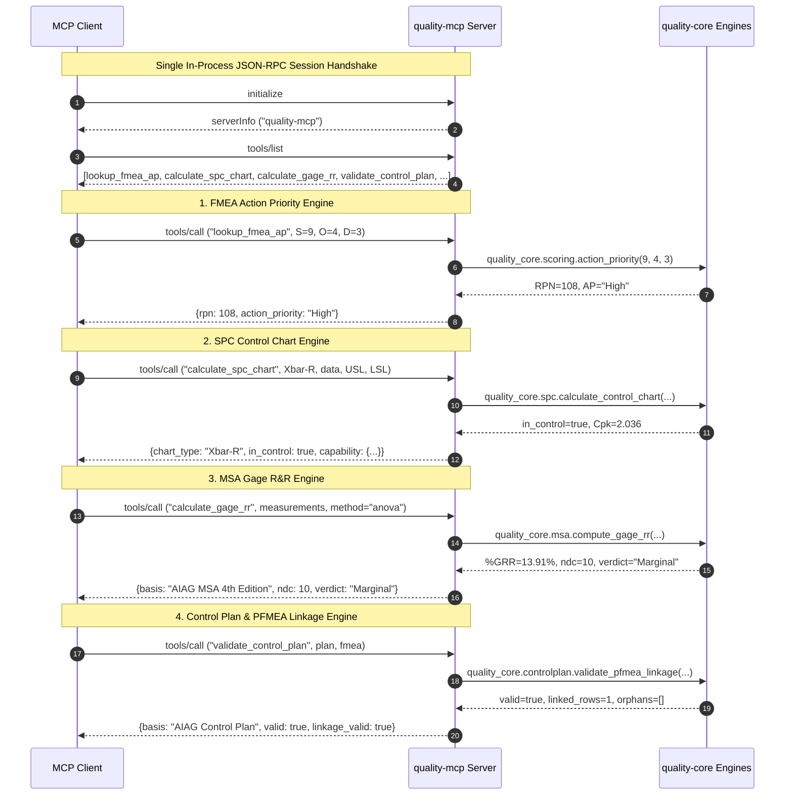

# Model Context Protocol (MCP) Client Setup

This guide details how to configure Model Context Protocol (MCP) clients—including Claude Code, Cursor, and other MCP-compliant hosts—to communicate with `quality-mcp`.

`quality-mcp` exposes the deterministic quality engineering engines in `quality-core` (Statistical Process Control, Measurement System Analysis, FMEA risk scoring, Control Plans) as callable MCP tools over standard transports.

---

## 1. Prerequisites

Before connecting an MCP client to `quality-mcp`:

1. **Python 3.11+** installed on your system.
2. **`uv` package manager** installed (`curl -LsSf https://astral.sh/uv/install.sh | sh` or `brew install uv`).
3. **Workspace dependencies installed**:
   ```bash
   uv sync --frozen
   ```
   This installs the workspace packages and registers the `quality-mcp` console script in the local `.venv`.

---

## 2. Configuration

### Automatic Discovery via `.mcp.json`

The repository root includes a standard [`.mcp.json`](../.mcp.json) configuration file:

```json
{
  "mcpServers": {
    "quality-mcp": {
      "command": "uv",
      "args": [
        "run",
        "quality-mcp"
      ]
    }
  }
}
```

MCP hosts that recognize repository-level `.mcp.json` files (such as Claude Code and Cursor) will discover and load the `quality-mcp` server automatically when opening this workspace.

---

### Claude Code Setup

Claude Code automatically detects [`.mcp.json`](../.mcp.json) in the workspace root. Alternatively, you can configure it explicitly using the Claude Code CLI or configuration files:

#### Option A: Project Configuration CLI
Run the following command from the repository root:
```bash
claude mcp add quality-mcp uv run quality-mcp
```

#### Option B: User Configuration (`~/.claude.json`)
To make `quality-mcp` available across workspaces, add the server to your global configuration with the absolute workspace directory:
```json
{
  "mcpServers": {
    "quality-mcp": {
      "command": "uv",
      "args": [
        "--directory",
        "/absolute/path/to/quality-engineering-skills",
        "run",
        "quality-mcp"
      ]
    }
  }
}
```

---

### Cursor Setup

Cursor supports MCP servers configured via workspace settings or global configuration:

#### Option A: Workspace Settings (`.cursor/mcp.json`)
Create or edit `.cursor/mcp.json` in the workspace root:
```json
{
  "mcpServers": {
    "quality-mcp": {
      "command": "uv",
      "args": [
        "run",
        "quality-mcp"
      ]
    }
  }
}
```

#### Option B: Cursor Settings UI
1. Open **Cursor Settings** (`Cmd+,` / `Ctrl+,`).
2. Navigate to **Features** > **MCP**.
3. Click **+ Add New MCP Server**.
4. Configure:
   - **Name**: `quality-mcp`
   - **Type**: `command`
   - **Command**: `uv run quality-mcp` (run from the workspace root).

---

## 3. Testing and Verification

### In-Process Round-Trip Suites
The automated test suites exercise MCP client-server protocol lifecycles (`initialize`, `tools/list`, and `tools/call`) using in-process memory transports:

1. **Ping Health Check Round-Trip**:
   ```bash
   uv run pytest packages/quality-mcp/tests/test_client_roundtrip.py -v
   ```

2. **FMEA Action Priority Round-Trip**:
   ```bash
   uv run pytest packages/quality-mcp/tests/test_fmea_client_roundtrip.py -v
   ```
   Validates session handshake, tool discovery of `lookup_fmea_ap`, round-trip evaluation against 12 real-world automotive DFMEA/PFMEA failure modes across High/Medium/Low Action Priority, dual structured and serialized payload parity against `quality_core.scoring`, and protocol-level negative controls for out-of-range integer scores, non-integer types, and unknown tools.

3. **SPC Client-Server Round-Trip**:
   ```bash
   uv run pytest packages/quality-mcp/tests/test_spc_client_roundtrip.py -v
   ```
   Validates in-process JSON-RPC execution of `calculate_spc_chart` across AIAG benchmark datasets (Xbar-R shaft diameters, I-MR coating thickness, attribute p/c charts), asserts dual-payload parity against `quality_core.spc`, verifies stability-gated capability withholding on out-of-control processes over the wire, and validates protocol-level error handling.

4. **MSA Client-Server Round-Trip**:
   ```bash
   uv run pytest packages/quality-mcp/tests/test_msa_client_roundtrip.py -v
   ```
   Validates in-process JSON-RPC execution of `calculate_gage_rr` across AIAG MSA 4th Edition benchmark datasets (10x3x3 crossed study case 1 and Example B), asserts dual-payload parity against `quality_core.msa`, verifies exact ANOVA and Average-and-Range decomposition parity against extracted reference fixtures, and validates protocol-level negative controls.

5. **Control Plan Client-Server Round-Trip**:
   ```bash
   uv run pytest packages/quality-mcp/tests/test_controlplan_client_roundtrip.py -v
   ```
   Validates in-process JSON-RPC execution of `validate_control_plan` across AIAG Control Plan benchmark datasets and FMEA fixtures, asserts dual-payload parity against `quality_core.controlplan`, verifies bidirectional PFMEA linkage, and checks protocol-level negative controls (orphan characteristics, tolerance inversions, malformed payloads).

6. **4-Engine Checkpoint Smoke Test (Milestone 5 Checkpoint)**:
   ```bash
   uv run pytest packages/quality-mcp/tests/test_four_engine_smoke.py -v
   ```
   Drives all four quality engineering tools (`lookup_fmea_ap`, `calculate_spc_chart`, `calculate_gage_rr`, `validate_control_plan`) through a **single** in-process FastMCP client session, verifying discovery, sequential execution without crosstalk, and independent error isolation.

### Coverage Gate
Run the full 100% line and branch coverage gate for `quality-mcp`:
```bash
uv run pytest packages/quality-mcp --cov=quality_mcp --cov-report=term-missing --cov-fail-under=100
```

---

## 4. Verified JSON-RPC Protocol Transcript

Below is a verified JSON-RPC 2.0 message exchange showing client initialization, tool discovery, and tool execution against `quality-mcp`.

### 4.1 Initialization (`initialize`)

**Client Request:**
```json
{
  "jsonrpc": "2.0",
  "id": 1,
  "method": "initialize",
  "params": {
    "protocolVersion": "2025-11-25",
    "capabilities": {
      "roots": {
        "listChanged": true
      }
    },
    "clientInfo": {
      "name": "mcp-client",
      "version": "1.0.0"
    }
  }
}
```

**Server Response:**
```json
{
  "jsonrpc": "2.0",
  "id": 1,
  "result": {
    "protocolVersion": "2025-11-25",
    "capabilities": {
      "prompts": {
        "listChanged": false
      },
      "resources": {
        "subscribe": false,
        "listChanged": false
      },
      "tools": {
        "listChanged": false
      }
    },
    "serverInfo": {
      "name": "quality-mcp",
      "version": "1.29.0"
    }
  }
}
```

**Client Notification:**
```json
{
  "jsonrpc": "2.0",
  "method": "notifications/initialized"
}
```

---

### 4.2 Tool Discovery (`tools/list`)

**Client Request:**
```json
{
  "jsonrpc": "2.0",
  "id": 2,
  "method": "tools/list",
  "params": {}
}
```

**Server Response:**
```json
{
  "jsonrpc": "2.0",
  "id": 2,
  "result": {
    "tools": [
      {
        "name": "ping",
        "description": "Health check endpoint confirming MCP server availability and version.",
        "inputSchema": {
          "type": "object",
          "title": "pingArguments",
          "properties": {}
        },
        "outputSchema": {
          "type": "object",
          "title": "pingDictOutput",
          "additionalProperties": {
            "type": "string"
          }
        }
      },
      {
        "name": "lookup_fmea_ap",
        "description": "Look up AIAG-VDA 2019 Action Priority and calculate RPN for an FMEA item.",
        "inputSchema": {
          "type": "object",
          "title": "lookup_fmea_apArguments",
          "properties": {
            "severity": {
              "title": "Severity",
              "description": "Severity rating (1–10 on the AIAG-VDA scale)",
              "type": "integer"
            },
            "occurrence": {
              "title": "Occurrence",
              "description": "Occurrence rating (1–10 on the AIAG-VDA scale)",
              "type": "integer"
            },
            "detection": {
              "title": "Detection",
              "description": "Detection rating (1–10 on the AIAG-VDA scale)",
              "type": "integer"
            }
          },
          "required": [
            "severity",
            "occurrence",
            "detection"
          ]
        }
      }
    ]
  }
}
```

---

### 4.3 Tool Invocation (`tools/call` -> `ping`)

**Client Request:**
```json
{
  "jsonrpc": "2.0",
  "id": 3,
  "method": "tools/call",
  "params": {
    "name": "ping",
    "arguments": {}
  }
}
```

**Server Response:**
```json
{
  "jsonrpc": "2.0",
  "id": 3,
  "result": {
    "content": [
      {
        "type": "text",
        "text": "{\n  \"status\": \"ok\",\n  \"server\": \"quality-mcp\",\n  \"version\": \"0.1.0\"\n}"
      }
    ],
    "structuredContent": {
      "status": "ok",
      "server": "quality-mcp",
      "version": "0.1.0"
    },
    "isError": false
  }
}
```

---

### 4.4 Tool Invocation (`tools/call` -> `lookup_fmea_ap` Success)

**Client Request:**
```json
{
  "jsonrpc": "2.0",
  "id": 4,
  "method": "tools/call",
  "params": {
    "name": "lookup_fmea_ap",
    "arguments": {
      "severity": 10,
      "occurrence": 4,
      "detection": 4
    }
  }
}
```

**Server Response:**
```json
{
  "jsonrpc": "2.0",
  "id": 4,
  "result": {
    "content": [
      {
        "type": "text",
        "text": "{\n  \"severity\": 10,\n  \"occurrence\": 4,\n  \"detection\": 4,\n  \"rpn\": 160,\n  \"action_priority\": \"High\"\n}"
      }
    ],
    "structuredContent": {
      "severity": 10,
      "occurrence": 4,
      "detection": 4,
      "rpn": 160,
      "action_priority": "High"
    },
    "isError": false
  }
}
```

---

### 4.5 Tool Invocation (`tools/call` -> `lookup_fmea_ap` Validation Error)

**Client Request:**
```json
{
  "jsonrpc": "2.0",
  "id": 5,
  "method": "tools/call",
  "params": {
    "name": "lookup_fmea_ap",
    "arguments": {
      "severity": 11,
      "occurrence": 5,
      "detection": 5
    }
  }
}
```

**Server Response:**
```json
{
  "jsonrpc": "2.0",
  "id": 5,
  "result": {
    "content": [
      {
        "type": "text",
        "text": "Error executing tool lookup_fmea_ap: Severity score 11 is out of range. Valid range is 1–10 (AIAG-VDA scale)."
      }
    ],
    "isError": true
  }
}
```

---

### 4.6 Tool Invocation (`tools/call` -> `calculate_spc_chart` In-Control Xbar-R Success)

**Client Request:**
```json
{
  "jsonrpc": "2.0",
  "id": 6,
  "method": "tools/call",
  "params": {
    "name": "calculate_spc_chart",
    "arguments": {
      "chart_type": "Xbar-R",
      "data": [
        [10.1, 10.0, 9.9, 10.2, 9.8],
        [9.9, 10.1, 10.0, 10.0, 10.1],
        [10.2, 9.8, 10.1, 9.9, 10.0],
        [10.0, 10.0, 10.1, 10.2, 9.9]
      ],
      "usl": 11.0,
      "lsl": 9.0
    }
  }
}
```

**Server Response:**
```json
{
  "jsonrpc": "2.0",
  "id": 6,
  "result": {
    "content": [
      {
        "type": "text",
        "text": "{\n  \"chart_type\": \"Xbar-R\",\n  \"basis\": \"AIAG SPC 4th Edition\",\n  \"center_line\": 10.015,\n  \"ucl\": 10.232,\n  \"lcl\": 9.798,\n  \"dispersion_center\": 0.375,\n  \"ucl_dispersion\": 0.793,\n  \"lcl_dispersion\": 0.0,\n  \"sigma_hat\": 0.1612,\n  \"points\": [10.0, 10.02, 10.0, 10.04],\n  \"dispersion_points\": [0.4, 0.2, 0.4, 0.5],\n  \"violations\": [],\n  \"in_control\": true,\n  \"stable\": true,\n  \"stability_note\": null,\n  \"capability\": {\n    \"cp\": 2.067,\n    \"cpk\": 2.036,\n    \"pp\": 2.085,\n    \"ppk\": 2.054,\n    \"mean\": 10.015,\n    \"sigma_hat\": 0.1612,\n    \"sigma_overall\": 0.1599,\n    \"n\": 20,\n    \"alpha\": 0.05,\n    \"pp_ci\": [1.534, 2.834],\n    \"ppk_ci\": [1.442, 2.666],\n    \"ppk_lower\": 1.543,\n    \"ci_estimator\": \"Bissell (1990) approximate\",\n    \"ci_df\": 19\n  }\n}"
      }
    ],
    "structuredContent": {
      "chart_type": "Xbar-R",
      "basis": "AIAG SPC 4th Edition",
      "center_line": 10.015,
      "ucl": 10.232,
      "lcl": 9.798,
      "dispersion_center": 0.375,
      "ucl_dispersion": 0.793,
      "lcl_dispersion": 0.0,
      "sigma_hat": 0.1612,
      "points": [10.0, 10.02, 10.0, 10.04],
      "dispersion_points": [0.4, 0.2, 0.4, 0.5],
      "violations": [],
      "in_control": true,
      "stable": true,
      "stability_note": null,
      "capability": {
        "cp": 2.067,
        "cpk": 2.036,
        "pp": 2.085,
        "ppk": 2.054,
        "mean": 10.015,
        "sigma_hat": 0.1612,
        "sigma_overall": 0.1599,
        "n": 20,
        "alpha": 0.05,
        "pp_ci": [1.534, 2.834],
        "ppk_ci": [1.442, 2.666],
        "ppk_lower": 1.543,
        "ci_estimator": "Bissell (1990) approximate",
        "ci_df": 19
      }
    },
    "isError": false
  }
}
```

---

### 4.7 Tool Invocation (`tools/call` -> `calculate_spc_chart` Out-of-Control Stability Gate Suppression)

**Client Request:**
```json
{
  "jsonrpc": "2.0",
  "id": 7,
  "method": "tools/call",
  "params": {
    "name": "calculate_spc_chart",
    "arguments": {
      "chart_type": "Xbar-R",
      "data": [
        [10.1, 10.0, 9.9, 10.2, 9.8],
        [9.9, 10.1, 10.0, 10.0, 10.1],
        [10.2, 9.8, 10.1, 9.9, 10.0],
        [15.0, 15.5, 14.8, 15.2, 15.1]
      ],
      "usl": 16.0,
      "lsl": 8.0
    }
  }
}
```

**Server Response:**
```json
{
  "jsonrpc": "2.0",
  "id": 7,
  "result": {
    "content": [
      {
        "type": "text",
        "text": "{\n  \"chart_type\": \"Xbar-R\",\n  \"basis\": \"AIAG SPC 4th Edition\",\n  \"center_line\": 11.305,\n  \"ucl\": 11.564,\n  \"lcl\": 11.046,\n  \"dispersion_center\": 0.45,\n  \"ucl_dispersion\": 0.951,\n  \"lcl_dispersion\": 0.0,\n  \"sigma_hat\": 0.1935,\n  \"points\": [10.0, 10.02, 10.0, 15.2],\n  \"dispersion_points\": [0.4, 0.2, 0.4, 0.8],\n  \"violations\": [\n    {\n      \"point_index\": 3,\n      \"rule\": \"Western Electric Rule 1 (beyond 3-sigma)\",\n      \"value\": 15.2,\n      \"center_line\": 11.305,\n      \"ucl\": 11.564,\n      \"lcl\": 11.046\n    }\n  ],\n  \"in_control\": false,\n  \"stable\": false,\n  \"stability_note\": \"Process is not in statistical control — 1 out-of-control signal(s) detected on the control chart. Capability indices (Cp/Cpk/Pp/Ppk) are not a valid capability claim until the process is stabilized; treat these values as indicative only.\",\n  \"capability\": null\n}"
      }
    ],
    "structuredContent": {
      "chart_type": "Xbar-R",
      "basis": "AIAG SPC 4th Edition",
      "center_line": 11.305,
      "ucl": 11.564,
      "lcl": 11.046,
      "dispersion_center": 0.45,
      "ucl_dispersion": 0.951,
      "lcl_dispersion": 0.0,
      "sigma_hat": 0.1935,
      "points": [10.0, 10.02, 10.0, 15.2],
      "dispersion_points": [0.4, 0.2, 0.4, 0.8],
      "violations": [
        {
          "point_index": 3,
          "rule": "Western Electric Rule 1 (beyond 3-sigma)",
          "value": 15.2,
          "center_line": 11.305,
          "ucl": 11.564,
          "lcl": 11.046
        }
      ],
      "in_control": false,
      "stable": false,
      "stability_note": "Process is not in statistical control — 1 out-of-control signal(s) detected on the control chart. Capability indices (Cp/Cpk/Pp/Ppk) are not a valid capability claim until the process is stabilized; treat these values as indicative only.",
      "capability": null
    },
    "isError": false
  }
}
```

---

### 4.8 Tool Invocation (`tools/call` -> `calculate_spc_chart` Validation Error)

**Client Request:**
```json
{
  "jsonrpc": "2.0",
  "id": 8,
  "method": "tools/call",
  "params": {
    "name": "calculate_spc_chart",
    "arguments": {
      "chart_type": "Xbar-R",
      "data": [
        [10.1, 10.0],
        [9.9, 10.1]
      ],
      "usl": 9.0,
      "lsl": 11.0
    }
  }
}
```

**Server Response:**
```json
{
  "jsonrpc": "2.0",
  "id": 8,
  "result": {
    "content": [
      {
        "type": "text",
        "text": "Error executing tool calculate_spc_chart: USL cannot be less than LSL."
      }
    ],
    "isError": true
  }
}
```

---

### 4.9 Tool Invocation (`tools/call` -> `calculate_gage_rr` ANOVA Success)

**Client Request:**
```json
{
  "jsonrpc": "2.0",
  "id": 9,
  "method": "tools/call",
  "params": {
    "name": "calculate_gage_rr",
    "arguments": {
      "measurements": [
        {"part": "P1", "appraiser": "A", "trial": 1, "measurement": 2.0},
        {"part": "P1", "appraiser": "A", "trial": 2, "measurement": 2.2},
        {"part": "P1", "appraiser": "B", "trial": 1, "measurement": 2.5},
        {"part": "P1", "appraiser": "B", "trial": 2, "measurement": 2.5},
        {"part": "P2", "appraiser": "A", "trial": 1, "measurement": 4.0},
        {"part": "P2", "appraiser": "A", "trial": 2, "measurement": 4.2},
        {"part": "P2", "appraiser": "B", "trial": 1, "measurement": 4.5},
        {"part": "P2", "appraiser": "B", "trial": 2, "measurement": 4.5},
        {"part": "P3", "appraiser": "A", "trial": 1, "measurement": 6.0},
        {"part": "P3", "appraiser": "A", "trial": 2, "measurement": 6.2},
        {"part": "P3", "appraiser": "B", "trial": 1, "measurement": 6.5},
        {"part": "P3", "appraiser": "B", "trial": 2, "measurement": 6.5}
      ],
      "method": "anova",
      "tolerance": 8.0
    }
  }
}
```

**Server Response:**
```json
{
  "jsonrpc": "2.0",
  "id": 9,
  "result": {
    "content": [
      {
        "type": "text",
        "text": "{\n  \"basis\": \"AIAG MSA 4th Edition\",\n  \"ev\": 0.0866,\n  \"av\": 0.2806,\n  \"grr\": 0.2937,\n  \"pv\": 2.0917,\n  \"tv\": 2.1122,\n  \"mean\": 4.1417,\n  \"pev_study\": 4.1005,\n  \"pav_study\": 13.2861,\n  \"pgrr_study\": 13.9056,\n  \"ppv_study\": 99.0285,\n  \"pev_tolerance\": 6.4952,\n  \"pav_tolerance\": 21.0468,\n  \"pgrr_tolerance\": 22.0283,\n  \"ppv_tolerance\": 156.8746,\n  \"ndc\": 10,\n  \"verdict\": \"Marginal\",\n  \"n_parts\": 3,\n  \"n_appraisers\": 2,\n  \"n_trials\": 2,\n  \"is_balanced\": true,\n  \"method\": \"anova\",\n  \"method_note\": \"ANOVA method (crossed two-factor with replication): the part x appraiser interaction IS estimated and tested. AIAG MSA 4th Ed., Ch. III Sec. B / Appendix A. When the interaction F statistic falls below its critical value \\\"the interaction term is pooled with the equipment (error) term\\\" and the interaction is reported as 0; when it does not, GRR = sqrt(EV^2 + AV^2 + INT^2) carries the interaction. The F-test uses alpha = 0.05, the level footnoted in the manual's own worked example (Table A 4); AIAG does not mandate a significance level. Negative variance components are set to zero, per Appendix A.\",\n  \"interaction\": 0.0,\n  \"interaction_f\": 0.0,\n  \"interaction_significant\": false\n}"
      }
    ],
    "structuredContent": {
      "basis": "AIAG MSA 4th Edition",
      "ev": 0.0866,
      "av": 0.2806,
      "grr": 0.2937,
      "pv": 2.0917,
      "tv": 2.1122,
      "mean": 4.1417,
      "pev_study": 4.1005,
      "pav_study": 13.2861,
      "pgrr_study": 13.9056,
      "ppv_study": 99.0285,
      "pev_tolerance": 6.4952,
      "pav_tolerance": 21.0468,
      "pgrr_tolerance": 22.0283,
      "ppv_tolerance": 156.8746,
      "ndc": 10,
      "verdict": "Marginal",
      "n_parts": 3,
      "n_appraisers": 2,
      "n_trials": 2,
      "is_balanced": true,
      "method": "anova",
      "method_note": "ANOVA method (crossed two-factor with replication): the part x appraiser interaction IS estimated and tested. AIAG MSA 4th Ed., Ch. III Sec. B / Appendix A. When the interaction F statistic falls below its critical value \"the interaction term is pooled with the equipment (error) term\" and the interaction is reported as 0; when it does not, GRR = sqrt(EV^2 + AV^2 + INT^2) carries the interaction. The F-test uses alpha = 0.05, the level footnoted in the manual's own worked example (Table A 4); AIAG does not mandate a significance level. Negative variance components are set to zero, per Appendix A.",
      "interaction": 0.0,
      "interaction_f": 0.0,
      "interaction_significant": false
    },
    "isError": false
  }
}
```

---

### 4.10 Tool Invocation (`tools/call` -> `calculate_gage_rr` Average-and-Range Success)

**Client Request:**
```json
{
  "jsonrpc": "2.0",
  "id": 10,
  "method": "tools/call",
  "params": {
    "name": "calculate_gage_rr",
    "arguments": {
      "measurements": [
        {"part": "P1", "appraiser": "A", "trial": 1, "measurement": 2.0},
        {"part": "P1", "appraiser": "A", "trial": 2, "measurement": 2.2},
        {"part": "P1", "appraiser": "B", "trial": 1, "measurement": 2.5},
        {"part": "P1", "appraiser": "B", "trial": 2, "measurement": 2.5},
        {"part": "P2", "appraiser": "A", "trial": 1, "measurement": 4.0},
        {"part": "P2", "appraiser": "A", "trial": 2, "measurement": 4.2},
        {"part": "P2", "appraiser": "B", "trial": 1, "measurement": 4.5},
        {"part": "P2", "appraiser": "B", "trial": 2, "measurement": 4.5},
        {"part": "P3", "appraiser": "A", "trial": 1, "measurement": 6.0},
        {"part": "P3", "appraiser": "A", "trial": 2, "measurement": 6.2},
        {"part": "P3", "appraiser": "B", "trial": 1, "measurement": 6.5},
        {"part": "P3", "appraiser": "B", "trial": 2, "measurement": 6.5}
      ],
      "method": "average_and_range"
    }
  }
}
```

**Server Response:**
```json
{
  "jsonrpc": "2.0",
  "id": 10,
  "result": {
    "content": [
      {
        "type": "text",
        "text": "{\n  \"basis\": \"AIAG MSA 4th Edition\",\n  \"ev\": 0.0886,\n  \"av\": 0.2805,\n  \"grr\": 0.2942,\n  \"pv\": 2.0924,\n  \"tv\": 2.1130,\n  \"mean\": 4.1417,\n  \"pev_study\": 4.1941,\n  \"pav_study\": 13.2758,\n  \"pgrr_study\": 13.9226,\n  \"ppv_study\": 99.0260,\n  \"pev_tolerance\": null,\n  \"pav_tolerance\": null,\n  \"pgrr_tolerance\": null,\n  \"ppv_tolerance\": null,\n  \"ndc\": 10,\n  \"verdict\": \"Marginal\",\n  \"n_parts\": 3,\n  \"n_appraisers\": 2,\n  \"n_trials\": 2,\n  \"is_balanced\": true,\n  \"method\": \"average_and_range\",\n  \"method_note\": \"Average-and-Range method: the part x appraiser interaction is NOT estimated. AIAG MSA 4th Ed., Ch. III Sec. B: the Average and Range method \\\"does not include\\\" the operator-to-part interaction, which is therefore absorbed into the reported components; %GRR is biased low when that interaction is non-zero. ANOVA (which separates it) is available via method=\\\"anova\\\".\",\n  \"interaction\": null,\n  \"interaction_f\": null,\n  \"interaction_significant\": null\n}"
      }
    ],
    "structuredContent": {
      "basis": "AIAG MSA 4th Edition",
      "ev": 0.0886,
      "av": 0.2805,
      "grr": 0.2942,
      "pv": 2.0924,
      "tv": 2.1130,
      "mean": 4.1417,
      "pev_study": 4.1941,
      "pav_study": 13.2758,
      "pgrr_study": 13.9226,
      "ppv_study": 99.0260,
      "pev_tolerance": null,
      "pav_tolerance": null,
      "pgrr_tolerance": null,
      "ppv_tolerance": null,
      "ndc": 10,
      "verdict": "Marginal",
      "n_parts": 3,
      "n_appraisers": 2,
      "n_trials": 2,
      "is_balanced": true,
      "method": "average_and_range",
      "method_note": "Average-and-Range method: the part x appraiser interaction is NOT estimated. AIAG MSA 4th Ed., Ch. III Sec. B: the Average and Range method \"does not include\" the operator-to-part interaction, which is therefore absorbed into the reported components; %GRR is biased low when that interaction is non-zero. ANOVA (which separates it) is available via method=\"anova\".",
      "interaction": null,
      "interaction_f": null,
      "interaction_significant": null
    },
    "isError": false
  }
}
```

---

### 4.11 Tool Invocation (`tools/call` -> `calculate_gage_rr` Validation Error)

**Client Request:**
```json
{
  "jsonrpc": "2.0",
  "id": 11,
  "method": "tools/call",
  "params": {
    "name": "calculate_gage_rr",
    "arguments": {
      "measurements": [
        {"part": "P1", "appraiser": "A", "trial": 1, "measurement": 2.0},
        {"part": "P1", "appraiser": "A", "trial": 2, "measurement": 2.2},
        {"part": "P1", "appraiser": "A", "trial": 3, "measurement": 2.1},
        {"part": "P1", "appraiser": "B", "trial": 1, "measurement": 2.5},
        {"part": "P1", "appraiser": "B", "trial": 2, "measurement": 2.5}
      ]
    }
  }
}
```

**Server Response:**
```json
{
  "jsonrpc": "2.0",
  "id": 11,
  "result": {
    "content": [
      {
        "type": "text",
        "text": "Error executing tool calculate_gage_rr: Data is unbalanced. This Gage R&R engine requires equal trials per (part, appraiser) cell. Found 2–3 trials across cells."
      }
    ],
    "isError": true
  }
}
```

---

### 4.12 Tool Invocation (`tools/call` -> `validate_control_plan` Success with PFMEA Linkage)

**Client Request:**
```json
{
  "jsonrpc": "2.0",
  "id": 12,
  "method": "tools/call",
  "params": {
    "name": "validate_control_plan",
    "arguments": {
      "plan": [
        {
          "characteristic": "Housing — Bore out of spec",
          "measurement_method": "Bore gauge",
          "sample_size": 5,
          "frequency": "per shift",
          "reaction_plan": "Contain and investigate.",
          "source_cause_id": "F1::F1-M1::F1-M1-C1"
        }
      ],
      "fmea": [
        {
          "ID": 1,
          "Process_Step": "Machining",
          "Component": "Housing",
          "Function": "Enclose piston",
          "Failure_Mode": "Bore out of spec",
          "Effect": "Piston seizure",
          "Severity": 9,
          "Cause": "Tool wear",
          "Occurrence": 4,
          "Current_Control": "Bore gauge",
          "Detection": 3
        }
      ]
    }
  }
}
```

**Server Response:**
```json
{
  "jsonrpc": "2.0",
  "id": 12,
  "result": {
    "content": [
      {
        "type": "text",
        "text": "{\n  \"basis\": \"AIAG Control Plan\",\n  \"valid\": true,\n  \"total_rows\": 1,\n  \"schema_valid\": true,\n  \"schema_findings\": [],\n  \"linkage_checked\": true,\n  \"linkage_valid\": true,\n  \"linked_rows\": 1,\n  \"orphan_characteristics\": [],\n  \"uncovered_failure_modes\": [],\n  \"linkage_findings\": []\n}"
      }
    ],
    "structuredContent": {
      "basis": "AIAG Control Plan",
      "valid": true,
      "total_rows": 1,
      "schema_valid": true,
      "schema_findings": [],
      "linkage_checked": true,
      "linkage_valid": true,
      "linked_rows": 1,
      "orphan_characteristics": [],
      "uncovered_failure_modes": [],
      "linkage_findings": []
    },
    "isError": false
  }
}
```

---

### 4.13 Tool Invocation (`tools/call` -> `validate_control_plan` Orphan Linkage Detection)

**Client Request:**
```json
{
  "jsonrpc": "2.0",
  "id": 13,
  "method": "tools/call",
  "params": {
    "name": "validate_control_plan",
    "arguments": {
      "plan": [
        {
          "characteristic": "Orphan Characteristic",
          "measurement_method": "Visual check",
          "sample_size": 1,
          "frequency": "per lot",
          "reaction_plan": "Segregate lot.",
          "source_cause_id": "F99::M99::C99"
        }
      ],
      "fmea": [
        {
          "ID": 1,
          "Process_Step": "Machining",
          "Component": "Housing",
          "Function": "Enclose piston",
          "Failure_Mode": "Bore out of spec",
          "Effect": "Piston seizure",
          "Severity": 9,
          "Cause": "Tool wear",
          "Occurrence": 4,
          "Current_Control": "Bore gauge",
          "Detection": 3
        }
      ]
    }
  }
}
```

**Server Response:**
```json
{
  "jsonrpc": "2.0",
  "id": 13,
  "result": {
    "content": [
      {
        "type": "text",
        "text": "{\n  \"basis\": \"AIAG Control Plan\",\n  \"valid\": false,\n  \"total_rows\": 1,\n  \"schema_valid\": true,\n  \"schema_findings\": [],\n  \"linkage_checked\": true,\n  \"linkage_valid\": false,\n  \"linked_rows\": 0,\n  \"orphan_characteristics\": [\n    \"Orphan Characteristic\"\n  ],\n  \"uncovered_failure_modes\": [\n    \"F1::F1-M1\"\n  ],\n  \"linkage_findings\": [\n    \"Orphan characteristic 'Orphan Characteristic': source_cause_id 'F99::M99::C99' does not exist in FMEA causes.\",\n    \"Uncovered FMEA failure mode 'F1::F1-M1' has no corresponding Control Plan row.\"\n  ]\n}"
      }
    ],
    "structuredContent": {
      "basis": "AIAG Control Plan",
      "valid": false,
      "total_rows": 1,
      "schema_valid": true,
      "schema_findings": [],
      "linkage_checked": true,
      "linkage_valid": false,
      "linked_rows": 0,
      "orphan_characteristics": [
        "Orphan Characteristic"
      ],
      "uncovered_failure_modes": [
        "F1::F1-M1"
      ],
      "linkage_findings": [
        "Orphan characteristic 'Orphan Characteristic': source_cause_id 'F99::M99::C99' does not exist in FMEA causes.",
        "Uncovered FMEA failure mode 'F1::F1-M1' has no corresponding Control Plan row."
      ]
    },
    "isError": false
  }
}
```

---

### 4.14 4-Engine Checkpoint Multi-Tool Session (FMEA + SPC + MSA + Control Plan)

The following sequence illustrates a single client session invoking all four deterministic quality engineering tools sequentially:



---

## 5. Troubleshooting

| Issue | Cause | Resolution |
|---|---|---|
| `command not found: uv` | `uv` is not installed or not in `$PATH` | Install `uv` via `curl -LsSf https://astral.sh/uv/install.sh \| sh` and ensure `~/.local/bin` (or `~/.cargo/bin`) is in your `$PATH`. |
| Server exits immediately | Missing workspace dependencies | Run `uv sync --frozen` in the repository root to synchronize the virtual environment. |
| Tool calls return unknown tool error | Tool name misspelled or not registered | Verify available tools via `tools/list` or check `packages/quality-mcp/src/quality_mcp/server.py`. |
| Working directory mismatch | Client launched `uv run` from a different folder | Provide `--directory /path/to/quality-engineering-skills` in the `args` array if launching from an external path. |

---

## Related Documentation

- [`README.md`](../README.md) — Platform overview and quickstart
- [`packages/quality-mcp/README.md`](../packages/quality-mcp/README.md) — MCP server package overview
- [`ROADMAP.md`](../ROADMAP.md) — Product roadmap and release milestones
